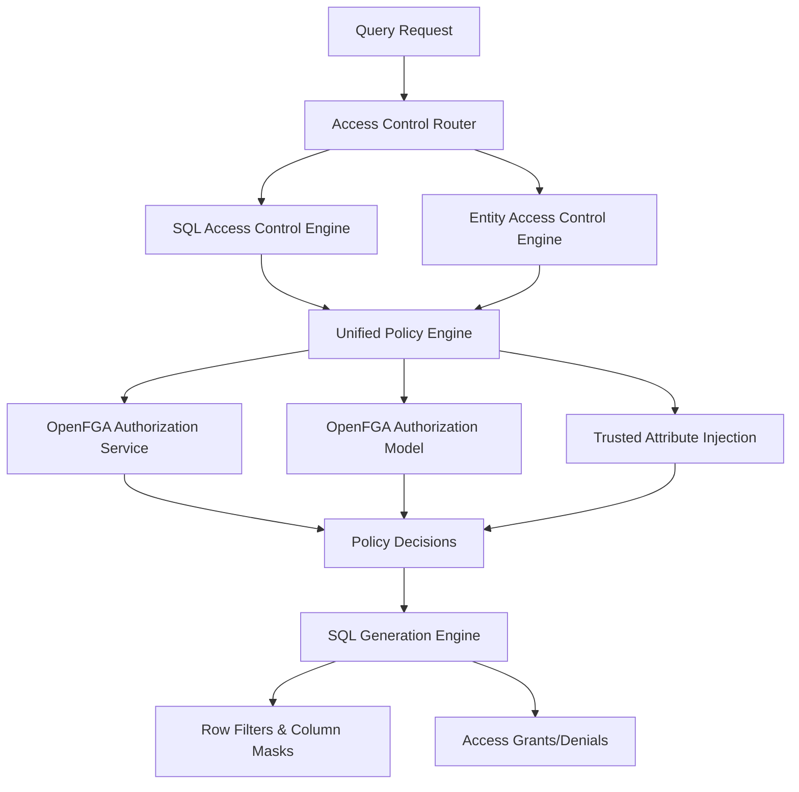

# Access Control Architecture

## Overview

This system implements **dual access control modes** that provide fine-grained access control across different abstraction layers. This dual approach enables both traditional SQL-oriented access control and modern entity-oriented access control to coexist and complement each other.

## Dual Access Control Modes

### SQL Access Control Mode

**SQL Access Control** operates at the **relational database abstraction layer** - the layer where administrators and developers think in terms of SQL constructs like catalogs, schemas, tables, views, columns, and rows.

**Key Characteristics:**

- **Scope**: Individual SQL objects (tables, views, columns, rows, catalogs, schemas)
- **Granularity**: Fine-grained access down to individual columns and rows
- **Policy Target**: Specific SQL constructs and their relationships
- **Administrator Mindset**: Database administrators working with SQL DDL/DML
- **Use Cases**: Traditional database security, column-level masking, row-level filtering, schema permissions

**Example Authorization Model:**

```openfga
model
  schema 1.1

type user

type role
  relations
    define member: [user]

type department
  relations
    define employee: [user]

type schema
  relations
    define admin: [user] or admin from parent
    define discover: [user, role#member] or admin
    define parent: [catalog]

type table
  relations
    define admin: [user] or admin from parent
    define select: [user, role#member] or admin
    define parent: [schema]

type data_field
  relations
    define select: [user, role#member with select_column_condition] or admin from parent
    define parent: [table]

condition select_column_condition(user_role: string, column_name: string) {
  user_role in ["hr_manager", "payroll_admin"] && column_name == "salary"
}
```

**Example Authorization Tuples (Schema-Driven):**

```json
// Column-level access control (attribute names configurable)
{
  "user": "role:{org_role_name}#member",
  "relation": "select",
  "object": "data_field:{org_table}.{org_sensitive_field}"
}

// Row-level access with configurable conditions
{
  "user": "user:{username}",
  "relation": "select",
  "object": "table:{org_data_table}",
  "condition": {
    "name": "{org_isolation_condition}",
    "context": {
      "{org_isolation_attribute}": "{org_isolation_value}"
    }
  }
}

// Schema-level access control (organization-specific naming)
{
  "user": "user:{username}",
  "relation": "discover",
  "object": "schema:{org_schema_name}"
}

// Generic examples showing flexibility:
// Healthcare: data_field:patient_records.ssn, condition: facility_access
// Financial: data_field:trades.customer_id, condition: trading_desk_filter
// Government: data_field:personnel.clearance, condition: security_level_check
// SaaS: data_field:accounts.billing_info, condition: tenant_isolation
```

### Entity Access Control Mode

**Entity Access Control** operates at the **conceptual business entity layer** - the layer where application developers think in terms of business objects like Asset, SecurityAdvisory, User, or Customer that may be persisted across multiple data stores.

**Key Characteristics:**

- **Scope**: Business entities that span multiple data stores and technologies
- **Granularity**: Entity-level policies that automatically apply across all storage implementations
- **Policy Target**: Business entities and their relationships, independent of storage technology
- **Administrator Mindset**: Application architects working with domain models and ORMs
- **Use Cases**: Cross-platform data governance, microservice data consistency, ORM-level security

**Example Scenario:**

```yaml
# Entity Definition: Asset entity persisted across multiple stores
entities:
  Asset:
    description: "IT Asset business entity"
    implementations:
      - catalog: postgres_prod     # Transactional data
        schema: assets
        table: assets

      - catalog: druid_analytics   # Analytics data
        schema: metrics
        table: asset_metrics

      - catalog: opensearch_logs   # Search and logging
        schema: events
        table: asset_events

      - catalog: s3_data_lake     # Data lake storage
        schema: raw
        table: asset_snapshots
```

**Entity-Level Authorization Model:**

```openfga
model
  schema 1.1

type user

type department
  relations
    define member: [user]

type entity_asset
  relations
    define access: [user, department#member] or owner
    define owner: [department]

type entity_asset_vulnerability
  relations
    define access: [user] or access from related_asset
    define related_asset: [entity_asset]
```

**Entity-Level Authorization Tuples:**

```json
// Department-based access to Asset entity (applies to ALL implementations)
{
  "user": "department:security#member",
  "relation": "access",
  "object": "entity_asset:server_001"
}

// Relationship-based access across entities
{
  "user": "user:alice",
  "relation": "access",
  "object": "entity_asset_vulnerability:cve_2023_001"
}

// Asset ownership by department
{
  "user": "department:infrastructure",
  "relation": "owner",
  "object": "entity_asset:server_001"
}

// AssetVulnerability relationship to Asset
{
  "user": "entity_asset:server_001",
  "relation": "related_asset",
  "object": "entity_asset_vulnerability:cve_2023_001"
}
```

## Architectural Benefits of Dual Modes

### Comprehensive Coverage

**SQL Mode** ensures no SQL construct is left without access control:

- Catalog-level permissions (discovery, schema creation)
- Schema-level permissions (object visibility, DDL operations)
- Table-level permissions (CRUD operations, metadata access)
- Column-level permissions (field access, masking, encryption)
- Row-level permissions (conditional access, filtering)

**Entity Mode** ensures business logic consistency:

- Unified access policies across heterogeneous data stores
- Business-rule enforcement independent of storage technology
- Simplified policy management for domain entities
- Consistent security across microservice boundaries

### Abstraction Layer Alignment

**SQL Mode** aligns with **database administrator workflows**:

- Familiar SQL-centric security concepts
- Direct mapping to existing database security models
- Natural integration with SQL tools and processes
- Clear audit trails in database-oriented terms

**Entity Mode** aligns with **application developer workflows**:

- Natural mapping to object-oriented and domain-driven design
- Integration with ORM frameworks and data access layers
- Business-rule enforcement at the conceptual level
- Simplified security for complex multi-store applications

### Complementary Strengths

**SQL Mode Strengths:**

- **Granular Control**: Column and row-level precision
- **Performance**: Direct integration with query execution engine
- **Familiarity**: Leverages existing SQL security knowledge
- **Connector Coverage**: Works with all Trino connectors automatically

**Entity Mode Strengths:**

- **Consistency**: Same policy across multiple stores
- **Simplicity**: Single policy for complex multi-store entities
- **Business Alignment**: Policies match domain logic
- **Future-Proof**: Independent of storage technology changes

## Integration Architecture

### Unified Policy Engine

Both access control modes are powered by the same underlying policy engine:



### Resolution Priority

When both modes apply to the same data access:

1. **Entity policies** are evaluated first (broader business rules)
2. **SQL policies** are evaluated second (specific technical constraints)
3. **Intersection approach**: Access requires approval from both layers
4. **Audit logging** captures decisions from both policy layers

### Configuration Integration

Both modes share common configuration patterns:

```yaml
access_control:
  sql_mode:
    enabled: true
    default_deny: true
    inherit_permissions: true

  entity_mode:
    enabled: true
    entity_definitions: "/etc/trino/entities.yaml"
    cross_store_validation: true

  shared_configuration:
    authorization_service: "openfga"
    authorization_model: "/etc/trino/openfga-model.fga"
    attribute_injection: "enabled"
    caching_strategy: "multi_tier"
```

## Use Case Scenarios

### Scenario 1: Traditional Database Security (SQL Mode Primary)

**Context**: Migrating from traditional database with existing SQL-based security model

**Approach**:

- Start with SQL Access Control mode
- Map existing database permissions to policy definitions
- Leverage familiar SQL security concepts
- Gradual migration path from legacy systems

### Scenario 2: Microservice Architecture (Entity Mode Primary)

**Context**: Modern application with entities spanning multiple microservices and data stores

**Approach**:

- Start with Entity Access Control mode
- Define business entities and their cross-store mappings
- Implement entity-level policies matching domain logic
- SQL mode provides additional fine-grained controls where needed

### Scenario 3: Hybrid Enterprise (Both Modes)

**Context**: Large enterprise with both legacy SQL systems and modern applications

**Approach**:

- Entity mode for new applications and cross-system integration
- SQL mode for existing database-centric applications
- Gradual migration strategy with coexistence period
- Unified policy management across both approaches

## Implementation Considerations

### Performance Impact

**SQL Mode**: Lower overhead due to direct query integration
**Entity Mode**: Higher setup cost due to entity resolution, but cached for subsequent operations

### Policy Complexity

**SQL Mode**: Policies can be very granular but may become numerous
**Entity Mode**: Fewer policies overall but require careful entity modeling

### Maintenance

**SQL Mode**: Changes require understanding SQL schema evolution
**Entity Mode**: Changes require understanding business domain evolution

### Migration Path

Organizations can adopt either mode independently or migrate gradually:

1. **SQL-First**: Start with familiar SQL security, add entity layer later
2. **Entity-First**: Start with business entities, add SQL refinements later
3. **Parallel**: Implement both simultaneously with clear policy boundaries

---
