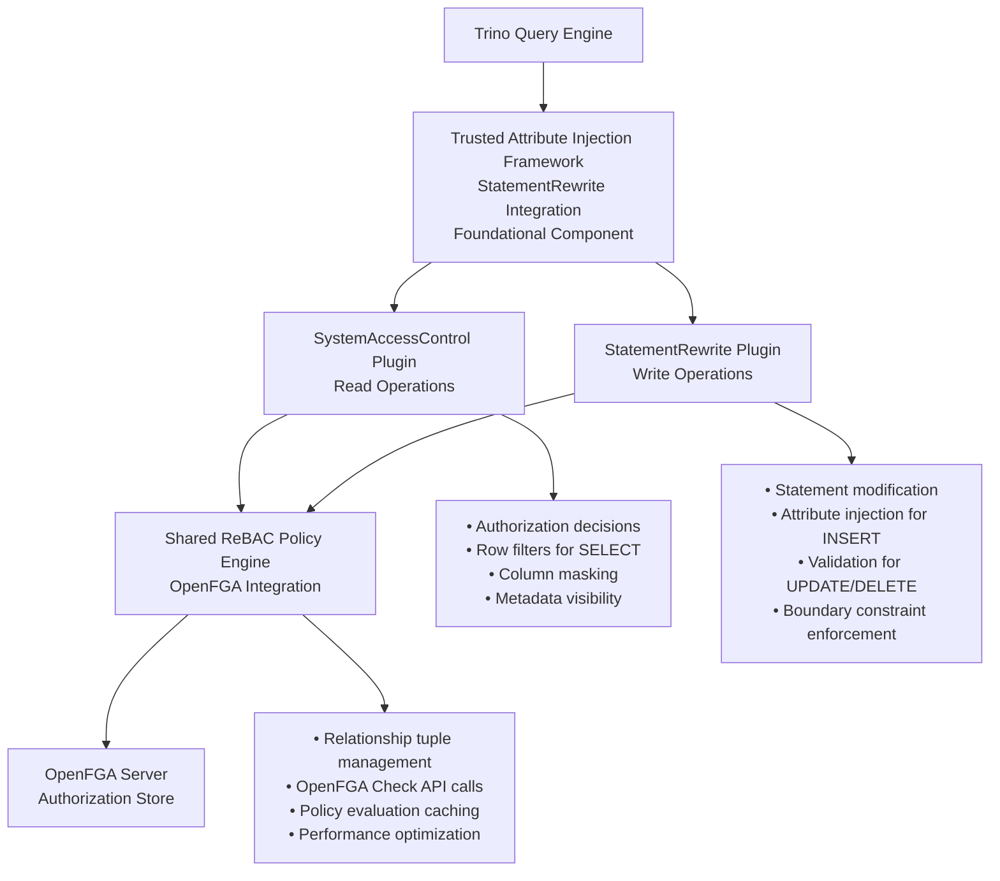
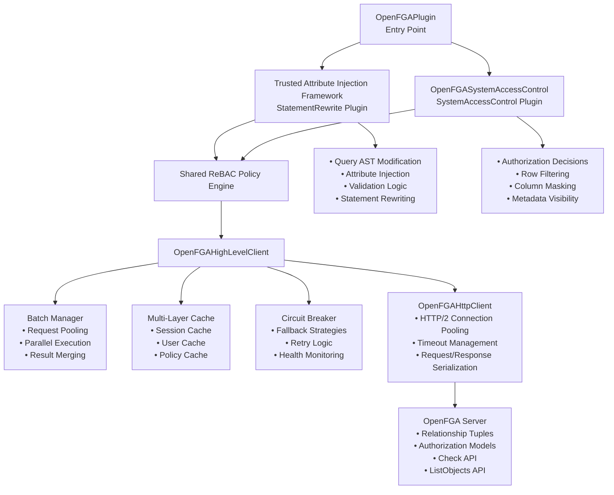
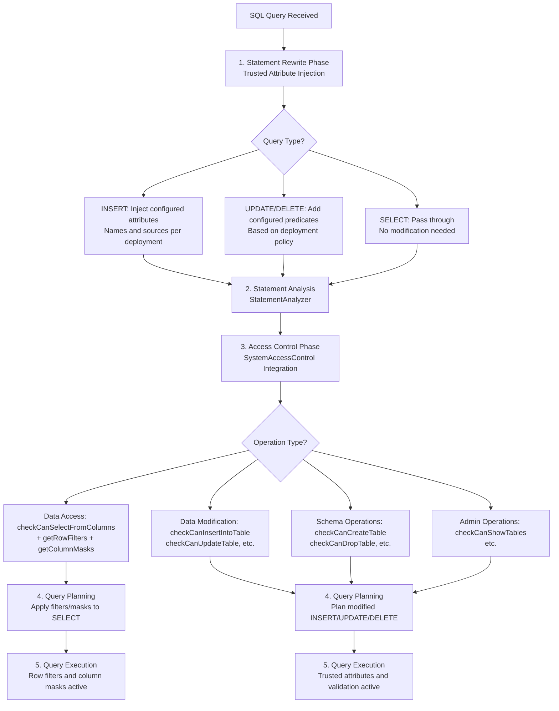
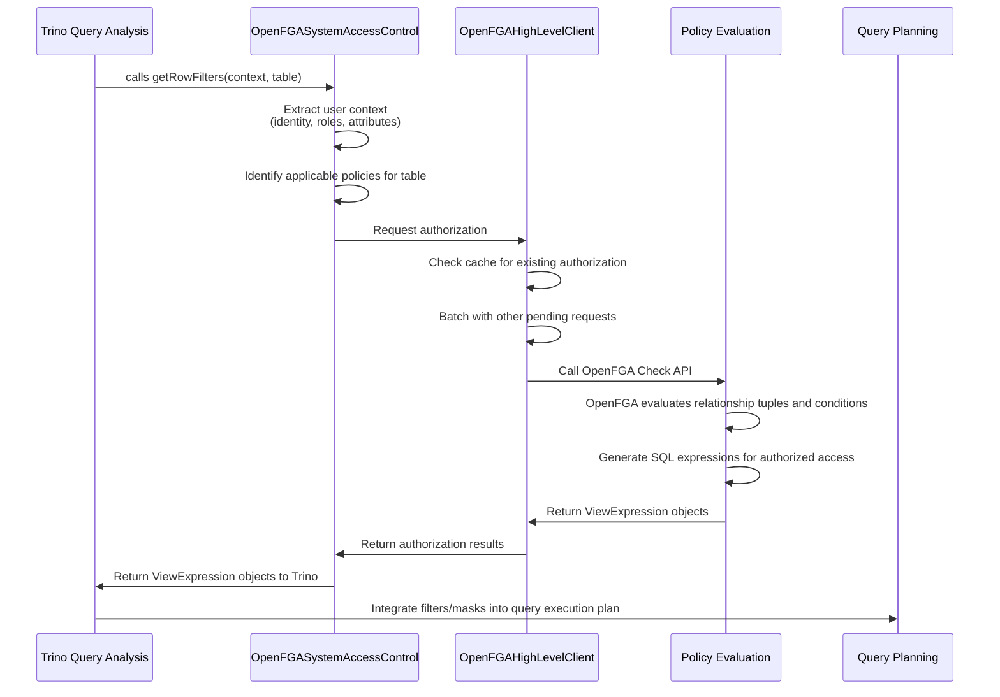

# Architecture Overview

## General-Purpose Access Control Framework

This system is designed as a **configurable framework** for Apache Trino access control that adapts to any organization's requirements rather than implementing specific use cases. Key design principles:

### Schema Agnostic Design

- **OpenFGA Schema Flexibility**: Organizations use their existing OpenFGA deployments with their own entity types, relationships, and tuple structures
- **No Prescribed Schema**: The plugin adapts to customer schemas rather than requiring specific entity/relationship definitions
- **Configurable Mappings**: Entity types, relationships, and tuple structures are configuration-driven

### Extensible Attribute Resolution

- **Configuration-First**: Common attribute sources (JWT claims, database lookups, static values) handled through configuration
- **Programmatic Extension Points**: Service Provider Interface (SPI) for custom AttributeProvider implementations when configuration cannot express the required logic
- **Hybrid Approach**: Built-in providers for standard cases, custom Java classes for complex scenarios

### Universal Applicability

Examples of supported use cases include multi-tenancy isolation, document management, healthcare data segregation, financial compliance, government clearance systems, and custom business models - all through the same framework with different configurations.

## System Architecture

The access control system implements fine-grained access control for Apache Trino using a **dual-interface architecture** that provides access control across **all SQL operations**. The system integrates with OpenFGA for ReBAC authorization decisions and includes a foundational Trusted Attribute Injection framework.

## Access Control Coverage Scope

The plugin provides access control for all categories of SQL operations in Trino:

- **Data Access (SELECT)**: Authorization + Row Filtering + Column Masking
- **Data Modification (INSERT/UPDATE/DELETE/TRUNCATE/MERGE)**: Authorization + Statement Rewriting
- **Schema Operations (CREATE/ALTER/DROP)**: Authorization
- **Administrative Operations (SHOW/DESCRIBE/EXPLAIN)**: Authorization + Metadata Filtering
- **System Operations (GRANT/REVOKE)**: Authorization

This comprehensive coverage requires integration at multiple points in Trino's architecture, leading to our dual-interface design.

## Dual-Interface Architecture



### Why Dual-Interface Architecture?

**SystemAccessControl Responsibilities**:

- **Data Access (SELECT)**: Authorization decisions + row filtering + column masking
- **Schema Operations (CREATE/ALTER/DROP)**: Authorization decisions
- **Administrative Operations (SHOW/DESCRIBE/EXPLAIN)**: Authorization decisions + metadata filtering
- **System Operations (GRANT/REVOKE)**: Authorization decisions
- **Data Modification**: Authorization decisions only (cannot modify SQL statements)

**SystemAccessControl Limitations**:

- Can add WHERE clauses to SELECT queries via `getRowFilters()` but cannot modify INSERT/UPDATE/DELETE statements
- No access to INSERT values or UPDATE/DELETE predicates for validation
- Cannot inject trusted columns into INSERT statements
- Cannot add validation predicates to UPDATE/DELETE WHERE clauses

**StatementRewrite Responsibilities**:

- **Data Modification (INSERT/UPDATE/DELETE/TRUNCATE/MERGE)**: Statement modification for attribute injection and validation
- **All Operations**: Can inject trusted attributes and modify query structure before analysis

**Shared Components**:

- Both interfaces use the same OpenFGA policy engine
- Consistent authorization decisions across all operation types
- Shared performance optimizations (caching, batching)

## Core Architecture Components



## Integration with Trino Security Framework

The dual-interface architecture integrates at two key points in Trino's query processing pipeline:

### StatementRewrite Integration (Trusted Attribute Injection Framework)

**Integration Point**: Query AST modification before semantic analysis
**Handles**: All SQL operations, with focus on write operations (INSERT/UPDATE/DELETE)

```java
public class TrustedAttributeInjectionPlugin implements EventListener {

    @Override
    public Statement rewriteStatement(
            Session session,
            Statement statement,
            List<Expression> parameters,
            WarningCollector warningCollector) {

        // Inject trusted attributes into all operations
        return attributeInjectionEngine.injectAttributes(statement, session);
    }
}
```

**Key Capabilities**:

- Injects configured trusted attributes into INSERT statements (attribute names and sources defined per deployment)
- Enforces access boundaries for UPDATE/DELETE statements (configurable: all-or-nothing validation vs. filtered execution)
- Modifies query AST before type checking and semantic analysis
- Provides attribute context for downstream authorization decisions

### SystemAccessControl Integration (Authorization and Filtering)

**Integration Point**: Authorization decisions and data filtering
**Handles**: Authorization decisions for all operations, data filtering for SELECT operations

```java
public class OpenFGASystemAccessControl implements SystemAccessControl {

    // Authorization decisions for all operations
    @Override
    public void checkCanSelectFromColumns(SystemSecurityContext context,
                                        CatalogSchemaTableName table,
                                        Set<String> columns);

    @Override
    public void checkCanInsertIntoTable(SystemSecurityContext context,
                                      CatalogSchemaTableName table);

    @Override
    public void checkCanCreateTable(SystemSecurityContext context,
                                  CatalogSchemaTableName table);

    // Data filtering for SELECT operations
    @Override
    public List<ViewExpression> getRowFilters(SystemSecurityContext context,
                                            CatalogSchemaTableName tableName);

    @Override
    public Map<ColumnSchema, ViewExpression> getColumnMasks(SystemSecurityContext context,
                                                           CatalogSchemaTableName tableName,
                                                           List<ColumnSchema> columns);

    // ... 50+ other authorization check methods
}
```

### Dual-Interface Query Processing Integration

The two interfaces integrate at different stages of Trino's query processing pipeline:



**Key Integration Points**:

1. **Early Integration (StatementRewrite)**: Modifies query AST before semantic analysis
2. **Authorization Integration (SystemAccessControl)**: Makes access decisions during query analysis
3. **Execution Integration**: Security constraints are compiled into the query execution plan

### Processing Nested SQL Structures

Trino processes complex queries using depth-first AST traversal. Access control must be applied at each nesting level:

**Processing Order for Nested Queries**:

```sql
-- Example: Complex query with CTEs, JOINs, and subqueries
WITH cte AS (SELECT * FROM table_a WHERE dept = 'finance')
SELECT c.*, sub.total
FROM cte c
JOIN (SELECT customer_id, COUNT(*) as total FROM table_b GROUP BY customer_id) sub
ON c.customer_id = sub.customer_id
WHERE c.status = 'active'
```

**Trino Processing Sequence**:

1. **WITH clause**: Analyze CTE query (`table_a` access control applied)
2. **FROM clause**: Process `cte` reference, then JOIN
3. **JOIN right side**: Analyze subquery (`table_b` access control applied)
4. **JOIN condition**: Process ON clause
5. **WHERE/SELECT**: Process remaining clauses

**Access Control Integration**:

- **StatementRewrite**: Can inject row filters into CTEs, subqueries, and JOINs before analysis
- **SystemAccessControl**: Called for each table reference during AST traversal
- **Independent Evaluation**: Each nested structure gets separate access control decisions

## UPDATE/DELETE Enforcement Modes

The system supports configurable enforcement modes for UPDATE/DELETE operations when access control boundaries are involved:

### All-or-Nothing Mode

**Behavior**: Query succeeds only if user has permission for ALL rows that would be affected.

**Example**:

```sql
-- User executes (configured isolation attribute determines access):
UPDATE users SET name='John' WHERE id IN (1, 2, 3)

-- If user can access rows 1,2 but not row 3 (based on configured policy):
-- Result: ENTIRE query rejected with authorization error
-- No rows are updated
```

**Use Cases**:

- Strict compliance environments
- Applications where partial failures could cause data inconsistency

**Configuration**:

```yaml
mutation_enforcement:
  mode: "all_or_nothing"
  on_unauthorized_row: "reject_query"
```

### Filtered Mode

**Behavior**: Query proceeds but only affects rows the user is authorized to modify.

**Example**:

```sql
-- Same query as above:
UPDATE users SET name='John' WHERE id IN (1, 2, 3)

-- System rewrites to (using configured isolation attribute):
UPDATE users SET name='John'
WHERE id IN (1, 2, 3) AND {configured_isolation_attr} = {user_isolation_value}

-- Result: Rows 1,2 updated, row 3 silently skipped
-- Query reports "2 rows affected"
```

**Use Cases**:

- Multi-tenant SaaS applications
- Systems where users routinely operate on mixed datasets
- Environments where silent filtering is expected behavior

**Configuration**:

```yaml
mutation_enforcement:
  mode: "filtered"
  on_unauthorized_row: "filter_silently"
  log_filtered_rows: true  # Optional: log skipped rows for audit
```

### Implementation Considerations

**All-or-Nothing Mode**:

- Requires pre-execution analysis of affected rows
- May need to execute SELECT query first to determine row ownership
- Performance impact from additional authorization checks
- Clear error messages indicating which rows caused authorization failure

**Filtered Mode**:

- Can leverage existing row filter mechanisms
- Lower performance impact (single query execution)
- Requires careful audit logging if compliance is needed
- May surprise users when fewer rows are affected than expected

**Error Handling**:

```java
// All-or-Nothing mode error
throw new TrinoException(ACCESS_DENIED,
    "UPDATE denied: user lacks permission for rows with IDs [3]. " +
    "User can only access rows matching configured access policies");

// Filtered mode (optional warning)
warnings.add(new WarningMessage(
    "UPDATE filtered: 1 row skipped due to access restrictions"));
```

## Design Principles

### System-Level Access Control

**Implementation Approach**:

- Works across all Trino connectors automatically
- No connector modifications required
- Centralized policy enforcement
- Consistent access control regardless of data source

### ReBAC-Driven SQL Generation

**Core Principle**: Administrators define OpenFGA relationship models; system automatically generates appropriate SQL expressions based on authorization decisions.

```yaml
# Administrator defines OpenFGA authorization model
authorization_model: |
  type user
  type tenant
    relations
      define member: [user]
  type dataset
    relations
      define tenant: [tenant]
      define viewer: [user] or member from tenant

# System evaluates OpenFGA relationships and generates SQL
openfga_check: "check(user:alice, viewer, dataset:orders)"
# Returns: true (alice is member of tenant, dataset belongs to tenant)

# System generates SQL based on authorization result and configured schema
generated_sql: "WHERE {configured_isolation_attr} = ${session.user.configured_isolation_value}"

# Trino executes with filter baked into plan
executed_query: |
  SELECT * FROM orders
  WHERE {configured_isolation_attr} = {resolved_isolation_value}  -- Based on OpenFGA relationship
    AND order_date > '2024-01-01'  -- User's original WHERE clause
```

### Performance Goals

**Performance Optimization Areas** (require detailed design):

- **Caching Strategy**: Multi-level caching of OpenFGA authorization results (design TBD)
- **Batch Processing**: Multiple authorization checks in single OpenFGA call
- **Request Optimization**: Minimize network calls to OpenFGA service

### Extensible Integration Layer

**Multi-Integration Support**:

```java
// Abstraction allows multiple integration approaches
public interface EntityAccessControlProvider {
    EntityMetadata getEntityMetadata(String entityName);
    List<TableMapping> getTableMappings(String entityName);
    AuthorizationPolicy getEntityPolicy(String entityName, String operation);
}

// Implementations for different integration patterns
public class ConfigBasedEntityProvider implements EntityAccessControlProvider;
public class APIBasedEntityProvider implements EntityAccessControlProvider;
public class DatabaseDrivenEntityProvider implements EntityAccessControlProvider;
```

## Component Responsibilities

### OpenFGAPlugin (Entry Point)

- Implements Trino `Plugin` interface
- Registers both `SystemAccessControlFactory` and `EventListener` (StatementRewrite)
- Manages plugin lifecycle and coordination between components

### TrustedAttributeInjectionPlugin (StatementRewrite)

- Implements Trino `EventListener` interface for statement rewrite
- Handles query AST modification before semantic analysis
- Injects trusted attributes into INSERT/UPDATE/DELETE operations
- Provides foundation for both security and non-security use cases

### OpenFGASystemAccessControl (Authorization and Filtering)

- Implements all `SystemAccessControl` interface methods
- Makes authorization decisions for all SQL operations
- Generates row filters and column masks for SELECT operations
- Coordinates with shared ReBAC policy engine

### Shared ReBAC Policy Engine

- Coordinates OpenFGA authorization decisions between both interfaces
- Manages relationship tuple evaluation and caching
- Handles performance optimization across both interfaces

### OpenFGAHighLevelClient (Authorization Layer)

- Abstracts OpenFGA API interactions
- Handles batch processing and caching
- Provides circuit breaker and retry logic

### OpenFGAHttpClient (Transport Layer)

- HTTP client with connection pooling
- Request/response serialization
- Low-level retry and timeout handling

## Data Flow

### Authorization Check Flow



## Configuration Architecture

The access control system supports configuration through standard Trino configuration files:

```properties
# /etc/access-control.properties
access-control.name=openfga

# OpenFGA connection settings
openfga.api.url=http://localhost:8080
openfga.store.id=01HXYZ123
openfga.authorization.model.id=01HXYZ456

# Performance settings
openfga.cache.enabled=true
openfga.cache.session.ttl=300s
openfga.batch.size=100
openfga.http.timeout=5s
```

## Error Handling and Fallback

### Graceful Degradation

- Cache serves stale authorization decisions during outages
- Configurable staleness tolerance
- Monitoring and alerting for degraded operation

---
