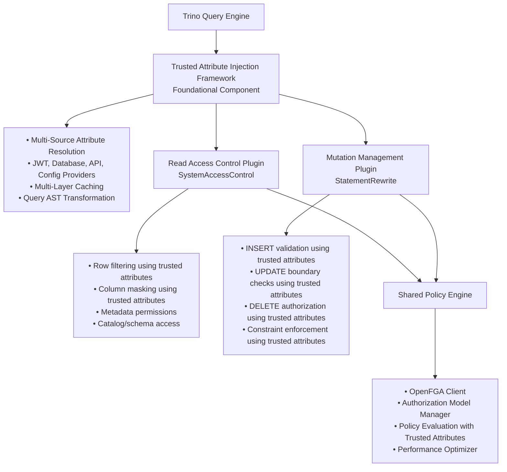

# Mutation Management Plugin Architecture

## Overview

Based on our research into Trino's write operation capabilities, we recommend a **layered architecture** that builds on the foundational **[Trusted Attribute Injection](trusted-attribute-injection.md)** framework:

1. **Trusted Attribute Injection Framework** - General-purpose capability for injecting attributes from configurable sources (JWT, database, API, computed values)
2. **OpenFGA Read Access Control Plugin** (`SystemAccessControl`) - Handles SELECT operations, row filtering, column masking using injected trusted attributes
3. **OpenFGA Mutation Management Plugin** (`StatementRewrite`) - Handles INSERT/UPDATE/DELETE/MERGE operations using injected trusted attributes for validation and constraint enforcement
4. **Shared Authorization Engine** - OpenFGA authorization service that evaluates policies using injected trusted attributes

This architecture provides clean separation of concerns while ensuring consistent attribute availability across all SQL operations for security, auditing, and compliance use cases.

## Architecture Components



## Mutation Management Plugin Design

### Core Integration Point: StatementRewrite

**Key Interface**: `io.trino.sql.rewrite.StatementRewrite.Rewrite`

The `StatementRewrite` interface provides the perfect integration point for mutation management:

✅ **Early Interception**: After SQL parsing, before semantic analysis
✅ **Full AST Access**: Complete access to INSERT/UPDATE/DELETE/MERGE nodes
✅ **Security Context**: Access to user identity and JWT claims
✅ **Query Transformation**: Ability to rewrite SQL statements
✅ **Clean Extension**: Standard Trino plugin mechanism

### Plugin Implementation Structure

```java
// 1. Main Plugin Entry Point
public class OpenFGAMutationPlugin implements Plugin {

    @Override
    public Iterable<Module> getModules() {
        return List.of(new OpenFGAMutationModule());
    }
}

// 2. Guice Module for Dependency Injection
public class OpenFGAMutationModule implements Module {

    @Override
    public void configure(Binder binder) {
        // Register the mutation rewriter
        Multibinder<StatementRewrite.Rewrite> rewriteBinder =
            Multibinder.newSetBinder(binder, StatementRewrite.Rewrite.class);
        rewriteBinder.addBinding().to(MutationSecurityRewriter.class).in(Scopes.SINGLETON);

        // Bind shared components
        binder.bind(SharedPolicyEngine.class).in(Scopes.SINGLETON);
        binder.bind(JwtClaimsExtractor.class).in(Scopes.SINGLETON);
        binder.bind(MutationValidator.class).in(Scopes.SINGLETON);
    }
}

// 3. Core Mutation Rewriter
public class MutationSecurityRewriter implements StatementRewrite.Rewrite {

    private final SharedPolicyEngine policyEngine;
    private final MutationValidator validator;
    private final MutationRewriter rewriter;

    @Inject
    public MutationSecurityRewriter(
            SharedPolicyEngine policyEngine,
            MutationValidator validator,
            MutationRewriter rewriter) {
        this.policyEngine = policyEngine;
        this.validator = validator;
        this.rewriter = rewriter;
    }

    @Override
    public Statement rewrite(
            AnalyzerFactory analyzerFactory,
            Session session,
            Statement node,
            List<Expression> parameters,
            Map<NodeRef<Parameter>, Expression> parameterLookup,
            WarningCollector warningCollector,
            PlanOptimizersStatsCollector planOptimizersStatsCollector) {

        // Only process mutation statements
        if (!isMutationStatement(node)) {
            return node;
        }

        // Extract security context
        SecurityContext securityContext = buildSecurityContext(session);

        // Process mutation with parse→validate→rewrite workflow
        return processMutation(node, securityContext);
    }

    private Statement processMutation(Statement node, SecurityContext securityContext) {
        return switch (node) {
            case Insert insert -> processInsert(insert, securityContext);
            case Update update -> processUpdate(update, securityContext);
            case Delete delete -> processDelete(delete, securityContext);
            case Merge merge -> processMerge(merge, securityContext);
            default -> node;
        };
    }
}
```

## Parse → Validate → Rewrite Workflow

### Parse Phase

```java
public class MutationParser {

    public MutationAnalysis parseStatement(Statement statement, SecurityContext context) {
        return switch (statement) {
            case Insert insert -> parseInsert(insert, context);
            case Update update -> parseUpdate(update, context);
            case Delete delete -> parseDelete(delete, context);
            case Merge merge -> parseMerge(merge, context);
            default -> throw new IllegalArgumentException("Not a mutation statement");
        };
    }

    private InsertAnalysis parseInsert(Insert insert, SecurityContext context) {
        return InsertAnalysis.builder()
            .targetTable(extractTableName(insert))
            .columns(extractColumns(insert))
            .values(extractValues(insert))
            .clientProvidedColumns(analyzeClientColumns(insert))
            .securityContext(context)
            .build();
    }
}
```

### Validate Phase

```java
public class MutationValidator {

    private final SharedPolicyEngine policyEngine;

    public ValidationResult validateMutation(MutationAnalysis analysis) {

        List<SecurityViolation> violations = new ArrayList<>();

        // 1. Validate table access permission
        if (!policyEngine.hasTableWriteAccess(analysis.getSecurityContext(), analysis.getTargetTable())) {
            violations.add(new SecurityViolation("No write access to table: " + analysis.getTargetTable()));
        }

        // 2. Validate client-provided values
        for (ColumnValue clientValue : analysis.getClientProvidedColumns()) {
            ValidationResult columnResult = validateColumnValue(clientValue, analysis.getSecurityContext());
            if (!columnResult.isValid()) {
                violations.add(new SecurityViolation(
                    "Column '" + clientValue.getColumnName() + "' validation failed: " + columnResult.getReason()
                ));
            }
        }

        // 3. Check for tenant boundary violations (multi-tenancy specific)
        if (analysis instanceof InsertAnalysis insert) {
            violations.addAll(validateTenantBoundaries(insert));
        }

        return ValidationResult.builder()
            .valid(violations.isEmpty())
            .violations(violations)
            .build();
    }

    private List<SecurityViolation> validateTenantBoundaries(InsertAnalysis insert) {
        String userTenantId = insert.getSecurityContext().getTenantId();
        List<SecurityViolation> violations = new ArrayList<>();

        // Check if client is trying to insert data for different tenant
        Optional<String> clientTenantId = insert.getClientProvidedTenantId();
        if (clientTenantId.isPresent() && !clientTenantId.get().equals(userTenantId)) {
            violations.add(new SecurityViolation(
                "Cannot insert data for tenant '" + clientTenantId.get() +
                "' - user belongs to tenant '" + userTenantId + "'"
            ));
        }

        return violations;
    }
}
```

### Rewrite Phase

```java
public class MutationRewriter {

    private final AttributeInjectionEngine injectionEngine;
    private final SecurityConstraintEngine constraintEngine;

    public Statement rewriteMutation(MutationAnalysis analysis, ValidationResult validation) {

        if (!validation.isValid()) {
            throw new AccessDeniedException("Mutation validation failed", validation.getViolations());
        }

        return switch (analysis) {
            case InsertAnalysis insert -> rewriteInsert(insert);
            case UpdateAnalysis update -> rewriteUpdate(update);
            case DeleteAnalysis delete -> rewriteDelete(delete);
            case MergeAnalysis merge -> rewriteMerge(merge);
        };
    }

    private Insert rewriteInsert(InsertAnalysis analysis) {
        Insert originalInsert = analysis.getOriginalStatement();

        // 1. Inject trusted attributes from JWT claims
        Insert withTrustedColumns = injectionEngine.injectTrustedColumns(
            originalInsert,
            analysis.getSecurityContext()
        );

        // 2. Add security constraints (if needed)
        Insert withConstraints = constraintEngine.addSecurityConstraints(
            withTrustedColumns,
            analysis.getApplicablePolicies()
        );

        return withConstraints;
    }

    private Update rewriteUpdate(UpdateAnalysis analysis) {
        Update originalUpdate = analysis.getOriginalStatement();

        // 1. Add tenant isolation WHERE clause
        Update withTenantIsolation = constraintEngine.addTenantIsolation(
            originalUpdate,
            analysis.getSecurityContext().getTenantId()
        );

        // 2. Validate SET clause doesn't modify protected columns
        Update validated = constraintEngine.validateSetClause(
            withTenantIsolation,
            analysis.getSecurityContext()
        );

        return validated;
    }

    private Delete rewriteDelete(DeleteAnalysis analysis) {
        Delete originalDelete = analysis.getOriginalStatement();

        // Add tenant isolation WHERE clause
        return constraintEngine.addTenantIsolation(
            originalDelete,
            analysis.getSecurityContext().getTenantId()
        );
    }
}
```

## Attribute Injection Engine

### Column Source Strategy Framework

```java
public enum ColumnSourceStrategy {
    CLIENT_PROVIDED,     // Value comes from client as-is (validated)
    JWT_CLAIM,          // Value extracted from JWT claim (trusted)
    DATABASE_LOOKUP,    // Value from database validation query
    CONFIG_LOOKUP,      // Value from configuration/policy lookup
    COMPUTED,           // Value computed (timestamps, UUIDs, etc.)
    FORCE_OVERRIDE      // Override client value with trusted value
}

public class AttributeInjectionEngine {

    private final JwtClaimsExtractor jwtExtractor;
    private final ConfigurationService configService;
    private final DatabaseLookupService dbLookupService;

    public Insert injectTrustedColumns(Insert originalInsert, SecurityContext securityContext) {

        // Get injection policies for target table
        List<ColumnInjectionPolicy> policies = getColumnInjectionPolicies(
            extractTableName(originalInsert)
        );

        Insert.Builder builder = Insert.builder(originalInsert);

        for (ColumnInjectionPolicy policy : policies) {
            Object injectedValue = resolveColumnValue(policy, securityContext);

            switch (policy.getStrategy()) {
                case JWT_CLAIM:
                case FORCE_OVERRIDE:
                    // Force inject, overriding any client value
                    builder.forceColumn(policy.getColumnName(), injectedValue);
                    break;

                case COMPUTED:
                    // Inject only if client didn't provide
                    builder.setColumnIfMissing(policy.getColumnName(), injectedValue);
                    break;

                case CLIENT_PROVIDED:
                    // Keep client value (already validated)
                    break;
            }
        }

        return builder.build();
    }

    private Object resolveColumnValue(ColumnInjectionPolicy policy, SecurityContext securityContext) {
        return switch (policy.getStrategy()) {
            case JWT_CLAIM -> jwtExtractor.extractClaim(
                securityContext.getIdentity(),
                policy.getSourceReference()
            );

            case DATABASE_LOOKUP -> dbLookupService.lookup(
                policy.getSourceReference(),
                securityContext
            );

            case CONFIG_LOOKUP -> configService.getValue(
                policy.getSourceReference()
            );

            case COMPUTED -> computeValue(
                policy.getSourceReference(),
                securityContext
            );

            default -> throw new IllegalArgumentException("Invalid strategy: " + policy.getStrategy());
        };
    }
}
```

## Multi-Tenancy Implementation Example

### Configuration

```yaml
# /etc/trino/mutation-policies.yaml
mutation_policies:
  multi_tenancy:
    enabled: true

    # Default tenant isolation for all tables
    default_tenant_policy:
      tenant_column: "tenant_id"
      jwt_claim: "tenant_id"

      insert_injection:
        tenant_id:
          source: jwt_claim
          jwt_claim: "tenant_id"
          strategy: FORCE_OVERRIDE

        created_by:
          source: jwt_claim
          jwt_claim: "sub"
          strategy: FORCE_OVERRIDE

        created_at:
          source: computed
          expression: "CURRENT_TIMESTAMP"
          strategy: INJECT_IF_MISSING

      update_constraints:
        - "tenant_id = ${jwt.tenant_id}"

      delete_constraints:
        - "tenant_id = ${jwt.tenant_id}"

    # Table-specific overrides
    table_overrides:
      "catalog.audit.audit_log":
        # Audit logs: admins can write to any tenant
        update_constraints:
          - "tenant_id = ${jwt.tenant_id} OR ${jwt.role} = 'admin'"
        delete_constraints:
          - "${jwt.role} = 'admin'"  # Only admins can delete audit logs
```

### Example Transformations

**Original INSERT (missing tenant_id):**

```sql
INSERT INTO orders (customer_id, amount, order_date)
VALUES (123, 99.99, '2024-01-15');
```

**Rewritten INSERT (with trusted columns):**

```sql
INSERT INTO orders (customer_id, amount, order_date, tenant_id, created_by, created_at)
VALUES (123, 99.99, '2024-01-15', 'tenant_abc', 'user123', CURRENT_TIMESTAMP);
```

**Original INSERT (malicious tenant_id):**

```sql
INSERT INTO orders (customer_id, amount, tenant_id, order_date)
VALUES (123, 99.99, 'tenant_xyz', '2024-01-15');  -- Different tenant!
```

**Validation Error:**

```
AccessDeniedException: Cannot insert data for tenant 'tenant_xyz' - user belongs to tenant 'tenant_abc'
```

**Original UPDATE (unrestricted):**

```sql
UPDATE orders SET amount = 109.99 WHERE order_id = 456;
```

**Rewritten UPDATE (with tenant isolation):**

```sql
UPDATE orders SET amount = 109.99
WHERE order_id = 456 AND tenant_id = 'tenant_abc';
```

## Shared Policy Engine Architecture

### Interface Design

```java
// Shared between read and mutation plugins
public interface SharedPolicyEngine {

    // Read operations (used by SystemAccessControl plugin)
    List<ViewExpression> getRowFilters(SecurityContext context, CatalogSchemaTableName table);
    Map<ColumnSchema, ViewExpression> getColumnMasks(SecurityContext context,
                                                    CatalogSchemaTableName table,
                                                    List<ColumnSchema> columns);

    // Write operations (used by mutation plugin)
    boolean hasTableWriteAccess(SecurityContext context, CatalogSchemaTableName table);
    List<ColumnInjectionPolicy> getColumnInjectionPolicies(CatalogSchemaTableName table);
    List<SecurityConstraint> getWriteConstraints(SecurityContext context,
                                                 CatalogSchemaTableName table,
                                                 MutationType mutationType);

    // Common operations
    SecurityContext buildSecurityContext(Session session);
    ValidationResult validateColumnValue(ColumnValue value, SecurityContext context);
}

// Implementation shared by both plugins
@Singleton
public class OpenFGASharedPolicyEngine implements SharedPolicyEngine {

    private final OpenFGAHighLevelClient openFGAClient;
    private final AuthorizationModelManager authorizationModelManager;
    private final JwtClaimsExtractor jwtExtractor;
    private final PerformanceOptimizer performanceOptimizer;

    // Implementation coordinates OpenFGA authorization with trusted attributes
}
```

## Integration with Connector-Level vs Trino-Level

### Analysis: Trino-Level vs Connector-Level Interception

| Approach | Pros | Cons | Recommendation |
|----------|------|------|----------------|
| **Trino-Level (StatementRewrite)** | ✅ Works across all connectors<br>✅ Single implementation<br>✅ Early interception<br>✅ Full security context | ❌ Limited metadata during rewrite<br>❌ Some complex transformations harder | **✅ RECOMMENDED** |
| **Connector-Level (ConnectorMetadata)** | ✅ Full table metadata available<br>✅ Native database integration possible<br>✅ Connector-specific optimizations | ❌ Must implement for each connector<br>❌ Late in processing pipeline<br>❌ Complex to maintain | ❌ Too complex for initial implementation |

### Hybrid Approach (Future Enhancement)

For **Phase 4** (performance optimization), consider a hybrid approach:

1. **Primary**: Trino-level StatementRewrite for universal coverage
2. **Optional**: Connector-level optimizations for high-performance databases

```java
// Future: Connector-specific optimization for PostgreSQL
public class PostgreSQLOptimizedMutationHandler extends BaseMutationHandler {

    @Override
    public Optional<ConnectorTableHandle> applyUpdate(
            ConnectorSession session,
            ConnectorTableHandle handle,
            Map<ColumnHandle, Constant> assignments) {

        // Leverage PostgreSQL's native Row-Level Security (RLS)
        // Push down tenant isolation to database level for performance
        return super.applyUpdate(session, handle, assignments);
    }
}
```

## Configuration-Based, Database-Based, Callback-Based Injection

### Multi-Source Attribute Resolution

```java
public interface AttributeResolver {
    Object resolveAttribute(String attributeName, SecurityContext context);
}

// Configuration-based resolver
@Component("config")
public class ConfigurationAttributeResolver implements AttributeResolver {

    @Override
    public Object resolveAttribute(String attributeName, SecurityContext context) {
        // Load from configuration files, environment variables, etc.
        return configurationService.getValue(attributeName);
    }
}

// Database-based resolver
@Component("database")
public class DatabaseAttributeResolver implements AttributeResolver {

    @Override
    public Object resolveAttribute(String attributeName, SecurityContext context) {
        // Query database for attribute value
        return databaseService.queryAttribute(attributeName, context.getUserId());
    }
}

// Callback-based resolver (custom logic)
@Component("callback")
public class CallbackAttributeResolver implements AttributeResolver {

    private final Map<String, AttributeCallback> callbacks;

    @Override
    public Object resolveAttribute(String attributeName, SecurityContext context) {
        AttributeCallback callback = callbacks.get(attributeName);
        if (callback != null) {
            return callback.resolve(context);
        }
        throw new IllegalArgumentException("No callback registered for: " + attributeName);
    }
}

// Usage in column injection policy
public class ColumnInjectionPolicy {
    private final ColumnSourceStrategy strategy;
    private final String resolverType;  // "config", "database", "callback"
    private final String sourceReference;

    // Examples:
    // strategy=DATABASE_LOOKUP, resolverType="database", sourceReference="SELECT department FROM users WHERE id = ?"
    // strategy=CONFIG_LOOKUP, resolverType="config", sourceReference="default.department"
    // strategy=COMPUTED, resolverType="callback", sourceReference="generateOrderNumber"
}
```

## Performance Considerations

### Statement Rewriting Overhead

**Expected Impact**: 5-15ms per mutation statement

**Mitigation Strategies**:

1. **Authorization Model Caching**: Pre-load and cache OpenFGA authorization model
2. **AST Template Caching**: Cache common rewrite patterns
3. **Batch Validation**: Validate multiple columns in single operations
4. **JWT Caching**: Cache decoded JWT claims per session

### Monitoring and Metrics

```java
@Component
public class MutationMetrics {

    private final MeterRegistry meterRegistry;

    public void recordMutationRewrite(String mutationType, Duration duration) {
        Timer.Sample sample = Timer.start(meterRegistry);
        sample.stop(Timer.builder("openfga.mutation.rewrite.time")
            .tag("mutation_type", mutationType)
            .register(meterRegistry));
    }

    public void recordValidationFailure(String reason) {
        meterRegistry.counter("openfga.mutation.validation.failures",
            "reason", reason).increment();
    }
}
```

This architecture provides a clean, extensible foundation for mutation management while maintaining the flexibility to support various attribute injection strategies and integration patterns.