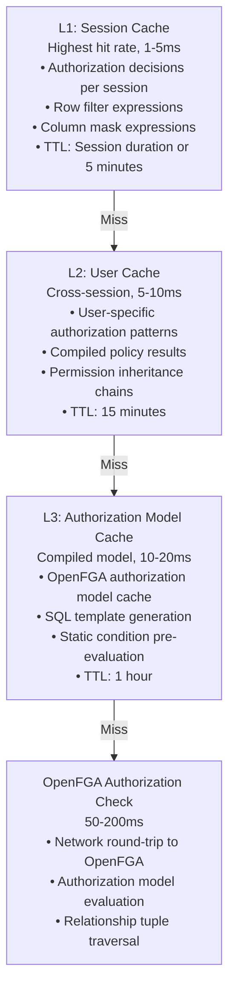

# Performance Optimization

## Performance Requirements

The OpenFGA plugin must deliver production-grade performance to be acceptable to the Apache Trino community. Key targets:

- **Authorization overhead**: <20ms per query for cached decisions
- **Throughput**: Support 1000+ authorization checks per second
- **Cache hit rate**: 95%+ for typical workloads
- **Availability**: Graceful degradation during OpenFGA outages
- **Scalability**: Linear performance scaling with cluster size

## Multi-Layer Caching Architecture

### Cache Hierarchy



### Cache Implementation

```java
@Component
public class HierarchicalCacheManager {

    // L1: Session-scoped cache (highest hit rate)
    private final ConcurrentHashMap<String, SessionCache> sessionCaches = new ConcurrentHashMap<>();

    // L2: User-scoped cache (cross-session)
    private final Cache<UserCacheKey, AuthorizationResult> userCache;

    // L3: Policy compilation cache (global)
    private final Cache<PolicyCacheKey, CompiledPolicy> policyCache;

    public AuthorizationResult getAuthorization(AuthorizationRequest request) {
        // L1: Check session cache first
        SessionCache sessionCache = getSessionCache(request.getSessionId());
        AuthorizationResult l1Result = sessionCache.get(request);
        if (l1Result != null) {
            metrics.recordCacheHit("L1");
            return l1Result;
        }

        // L2: Check user cache
        UserCacheKey userKey = new UserCacheKey(request.getUserId(), request.getResourceKey());
        AuthorizationResult l2Result = userCache.getIfPresent(userKey);
        if (l2Result != null) {
            metrics.recordCacheHit("L2");
            sessionCache.put(request, l2Result); // Promote to L1
            return l2Result;
        }

        // L3: Check compiled policy cache
        PolicyCacheKey policyKey = new PolicyCacheKey(request.getPolicyId());
        CompiledPolicy compiledPolicy = policyCache.getIfPresent(policyKey);
        if (compiledPolicy != null) {
            metrics.recordCacheHit("L3");
            AuthorizationResult result = evaluateCompiledPolicy(compiledPolicy, request);
            userCache.put(userKey, result); // Promote to L2
            sessionCache.put(request, result); // Promote to L1
            return result;
        }

        // Cache miss: Perform full authorization check
        metrics.recordCacheMiss("all_levels");
        return performFullAuthorizationCheck(request);
    }
}
```

## Batch Processing Strategy

### Intelligent Request Batching

```java
public class BatchAuthorizationManager {

    private final BatchingExecutor<AuthRequest, AuthResult> batchExecutor;
    private final OpenFGAClient openFGAClient;

    public BatchAuthorizationManager() {
        this.batchExecutor = BatchingExecutor.<AuthRequest, AuthResult>builder()
            .batchSize(100)                    // OpenFGA batch limit
            .batchTimeout(Duration.ofMillis(10)) // Collect requests for 10ms
            .parallelism(4)                    // 4 concurrent batches
            .processor(this::processBatch)
            .build();
    }

    public CompletableFuture<AuthResult> authorize(AuthRequest request) {
        return batchExecutor.submit(request);
    }

    private Map<AuthRequest, AuthResult> processBatch(List<AuthRequest> batch) {
        // Group by OpenFGA store for efficient batching
        Map<String, List<AuthRequest>> byStore = batch.stream()
            .collect(groupingBy(AuthRequest::getStoreId));

        // Process each store's requests in parallel
        return byStore.entrySet().parallelStream()
            .flatMap(entry -> processStoreRequests(entry.getKey(), entry.getValue()).entrySet().stream())
            .collect(toConcurrentMap(Map.Entry::getKey, Map.Entry::getValue));
    }

    private Map<AuthRequest, AuthResult> processStoreRequests(String storeId, List<AuthRequest> requests) {
        // Split into chunks of 100 (OpenFGA batch API limit)
        List<List<AuthRequest>> chunks = partition(requests, 100);

        return chunks.parallelStream()
            .flatMap(chunk -> {
                BatchCheckResponse response = openFGAClient.batchCheck(storeId, chunk);
                return mapResponseToResults(chunk, response).entrySet().stream();
            })
            .collect(toConcurrentMap(Map.Entry::getKey, Map.Entry::getValue));
    }
}
```

### Query-Level Batch Optimization

```java
public class QueryLevelBatchOptimizer {

    public List<ViewExpression> getRowFiltersOptimized(SystemSecurityContext context,
                                                      Set<CatalogSchemaTableName> tables) {
        // Collect all authorization requests for the query
        List<AuthRequest> requests = tables.stream()
            .map(table -> createAuthRequest(context, table))
            .collect(toList());

        // Batch authorize all tables in single operation
        Map<CatalogSchemaTableName, AuthResult> results = batchAuthorize(requests);

        // Generate row filters for authorized tables
        return results.entrySet().stream()
            .filter(entry -> entry.getValue().isAuthorized())
            .map(entry -> generateRowFilter(entry.getKey(), entry.getValue()))
            .collect(toList());
    }
}
```

## Predictive Pre-Authorization

### Session Startup Pre-Authorization

```java
@EventListener
public class PredictiveAuthorizationService {

    public void onSessionStart(SessionStartEvent event) {
        CompletableFuture.runAsync(() -> preauthorizeCommonPatterns(event));
    }

    private void preauthorizeCommonPatterns(SessionStartEvent event) {
        Identity user = event.getIdentity();

        // Pre-authorize user's most commonly accessed tables
        Set<CatalogSchemaTableName> commonTables = getUserAccessPatterns(user);
        preauthorizeTables(event.getSessionId(), user, commonTables);

        // Pre-authorize user's default schemas
        Set<CatalogSchemaName> defaultSchemas = getUserDefaultSchemas(user);
        preauthorizeSchemas(event.getSessionId(), user, defaultSchemas);

        // Pre-authorize role-based common access patterns
        Set<String> userRoles = user.getGroups();
        preauthorizeRolePatterns(event.getSessionId(), user, userRoles);
    }

    private void preauthorizeTables(String sessionId, Identity user, Set<CatalogSchemaTableName> tables) {
        List<AuthRequest> requests = tables.stream()
            .flatMap(table -> Stream.of(
                createTableAccessRequest(user, table, "select"),
                createTableAccessRequest(user, table, "show_create"),
                createRowFilterRequest(user, table)
            ))
            .collect(toList());

        batchAuthorizationManager.authorize(requests)
            .thenAccept(results -> cacheResults(sessionId, results));
    }
}
```

### Pattern-Based Pre-Authorization

```java
public class AccessPatternAnalyzer {

    public void analyzeAndPreauthorize(String sessionId, Identity user, QueryHistory queryHistory) {
        // Analyze user's query patterns
        AccessPatterns patterns = analyzePatterns(user, queryHistory);

        // Predict likely next access requests
        Set<AuthRequest> predictedRequests = predictNextRequests(patterns);

        // Pre-authorize predicted requests
        CompletableFuture.runAsync(() -> {
            Map<AuthRequest, AuthResult> results = batchAuthorizationManager.authorize(predictedRequests).join();
            cachePreauthorizedResults(sessionId, results);
        });
    }

    private AccessPatterns analyzePatterns(Identity user, QueryHistory history) {
        return AccessPatterns.builder()
            .frequentTables(extractFrequentTables(history))
            .commonJoinPatterns(extractJoinPatterns(history))
            .timeBasedPatterns(extractTimePatterns(history))
            .roleBased Patterns(extractRolePatterns(user, history))
            .build();
    }
}
```

## Policy Compilation and Optimization

### OpenFGA Authorization Model Optimization

```java
public class AuthorizationModelOptimizer {

    public OptimizedAuthorizationModel optimizeModel(AuthorizationModelMetadata model) {
        // 1. Pre-compute common authorization request patterns
        Map<String, List<String>> commonRequests = analyzeCommonPatterns(model);

        // 2. Build optimized tuple generation templates
        Map<String, TupleTemplate> tupleTemplates = buildTupleTemplates(model);

        // 3. Extract static conditions that can be pre-evaluated
        StaticConditions staticConditions = extractStaticConditions(model);

        // 4. Generate optimized SQL filter templates
        Map<String, SQLTemplate> sqlTemplates = generateSQLTemplates(model, staticConditions);

        // 5. Build authorization request cache
        AuthorizationRequestCache requestCache = buildRequestCache(model);

        return OptimizedAuthorizationModel.builder()
            .originalModel(model)
            .commonRequests(commonRequests)
            .tupleTemplates(tupleTemplates)
            .staticConditions(staticConditions)
            .sqlTemplates(sqlTemplates)
            .requestCache(requestCache)
            .cacheKey(generateCacheKey(model))
            .build();
    }

    private Map<String, SQLTemplate> generateSQLTemplates(AuthorizationModelMetadata model,
                                                         StaticConditions staticConditions) {
        Map<String, SQLTemplate> templates = new HashMap<>();

        // Generate SQL templates for each relation type
        for (String objectType : model.getSupportedTypes()) {
            Set<String> relations = model.getTypeRelations().get(objectType);
            for (String relation : relations) {
                SQLTemplate template = buildSQLTemplate(objectType, relation, staticConditions);
                templates.put(objectType + ":" + relation, template);
            }
        }

        return templates;
    }
}
```

### SQL Template Caching

```java
public class AuthorizationSQLCache {

    private final Cache<AuthorizationCacheKey, SQLTemplate> templateCache;

    public ViewExpression generateRowFilter(AuthorizationRequest request, AuthorizationContext context) {
        String templateKey = request.getResourceType() + ":" + request.getRelation();
        SQLTemplate template = templateCache.get(templateKey, () ->
            generateSQLTemplate(request.getResourceType(), request.getRelation())
        );

        // Bind parameters to context values from trusted attributes
        String sql = bindParameters(template, context);

        return ViewExpression.builder()
            .expression(sql)
            .identity(context.getIdentity())
            .catalog(context.getCatalog())
            .schema(context.getSchema())
            .build();
    }

    private String bindParameters(SQLTemplate template, AuthorizationContext context) {
        String sql = template.getSql();

        for (ParameterBinding binding : template.getParameters()) {
            Object value = context.getAttribute(binding.getName());
            sql = sql.replace(binding.getPlaceholder(), formatSQLValue(value, binding.getType()));
        }

        return sql;
    }
}
```

## Connection Pool Optimization

### OpenFGA HTTP Client Configuration

```java
@Configuration
public class OpenFGAClientConfiguration {

    @Bean
    public OpenFGAHttpClient openFGAHttpClient(OpenFGAConfig config) {
        return OpenFGAHttpClient.builder()
            // Connection pool settings
            .connectionPool(ConnectionPool.builder()
                .maxConnections(100)              // Pool size
                .maxConnectionsPerRoute(20)       // Per-endpoint limit
                .connectionIdleTimeout(Duration.ofMinutes(5))
                .connectionKeepAlive(Duration.ofMinutes(2))
                .build())

            // Timeout settings
            .connectTimeout(Duration.ofSeconds(2))
            .requestTimeout(Duration.ofSeconds(5))
            .readTimeout(Duration.ofSeconds(10))

            // Retry configuration
            .retryPolicy(RetryPolicy.builder()
                .maxAttempts(3)
                .backoffStrategy(BackoffStrategy.exponential(
                    Duration.ofMillis(100),
                    Duration.ofSeconds(2)
                ))
                .retryOn(ConnectException.class, SocketTimeoutException.class)
                .build())

            // Circuit breaker
            .circuitBreaker(CircuitBreaker.builder()
                .failureThreshold(10)             // 10 failures trigger open
                .recoveryTimeout(Duration.ofSeconds(30))
                .healthCheckInterval(Duration.ofSeconds(5))
                .build())

            .build();
    }
}
```

### Connection Pool Monitoring

```java
@Component
public class ConnectionPoolMonitor {

    @Scheduled(fixedRate = 30000) // Every 30 seconds
    public void monitorConnectionPool() {
        ConnectionPoolStats stats = httpClient.getConnectionPoolStats();

        // Record metrics
        meterRegistry.gauge("openfga.connection_pool.active", stats.getActiveConnections());
        meterRegistry.gauge("openfga.connection_pool.idle", stats.getIdleConnections());
        meterRegistry.gauge("openfga.connection_pool.pending", stats.getPendingRequests());

        // Alert on pool exhaustion
        if (stats.getActiveConnections() > 90) {
            alertManager.sendAlert("OpenFGA connection pool near exhaustion", stats);
        }
    }
}
```

## Circuit Breaker and Fallback Strategy

### Circuit Breaker Implementation

```java
public class OpenFGACircuitBreaker {

    private final CircuitBreaker circuitBreaker;
    private final FallbackStrategy fallbackStrategy;

    public AuthorizationResult authorizeWithFallback(AuthRequest request) {
        return circuitBreaker.execute(
            () -> performOpenFGAAuthorization(request),
            () -> fallbackStrategy.fallback(request)
        );
    }

    private AuthorizationResult performOpenFGAAuthorization(AuthRequest request) {
        try {
            return openFGAClient.check(request);
        } catch (Exception e) {
            circuitBreaker.recordFailure(e);
            throw e;
        }
    }
}
```

### Fallback Strategies

```java
public interface FallbackStrategy {
    AuthorizationResult fallback(AuthRequest request);
}

// Conservative fallback: Deny access when OpenFGA unavailable
@Component("deny-all-fallback")
public class DenyAllFallbackStrategy implements FallbackStrategy {
    public AuthorizationResult fallback(AuthRequest request) {
        return AuthorizationResult.denied("OpenFGA service unavailable");
    }
}

// Cached fallback: Use stale cache entries
@Component("cached-fallback")
public class CachedFallbackStrategy implements FallbackStrategy {
    public AuthorizationResult fallback(AuthRequest request) {
        // Allow stale cache entries during outage
        AuthorizationResult stale = cacheManager.getStaleEntry(request);
        if (stale != null) {
            return stale.withWarning("Using stale authorization decision");
        }
        return AuthorizationResult.denied("No cached authorization available");
    }
}

// Role-based fallback: Basic RBAC when fine-grained control unavailable
@Component("role-based-fallback")
public class RoleBasedFallbackStrategy implements FallbackStrategy {
    public AuthorizationResult fallback(AuthRequest request) {
        // Fall back to simple role-based authorization
        return roleBasedAuthorizationService.authorize(request);
    }
}
```

## Performance Monitoring and Metrics

### Key Performance Metrics

```java
@Component
public class PerformanceMetrics {

    private final MeterRegistry meterRegistry;

    public void recordAuthorizationTime(String cacheLevel, Duration duration) {
        Timer.Sample sample = Timer.start(meterRegistry);
        sample.stop(Timer.builder("openfga.authorization.time")
            .tag("cache_level", cacheLevel)
            .register(meterRegistry));
    }

    public void recordCacheHitRate(String cacheLevel, boolean hit) {
        meterRegistry.counter("openfga.cache.access",
            "level", cacheLevel,
            "result", hit ? "hit" : "miss"
        ).increment();
    }

    public void recordBatchSize(int size) {
        meterRegistry.summary("openfga.batch.size").record(size);
    }

    public void recordOpenFGALatency(Duration latency) {
        meterRegistry.timer("openfga.api.latency").record(latency);
    }
}
```

### Performance Dashboards

Key metrics to monitor:

- Authorization decision latency (p50, p95, p99)
- Cache hit rates by level (L1, L2, L3)
- OpenFGA API call frequency and latency
- Batch processing efficiency
- Circuit breaker state and fallback usage
- Connection pool utilization

---
