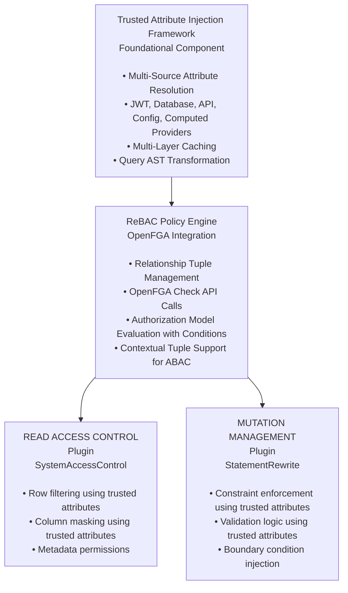
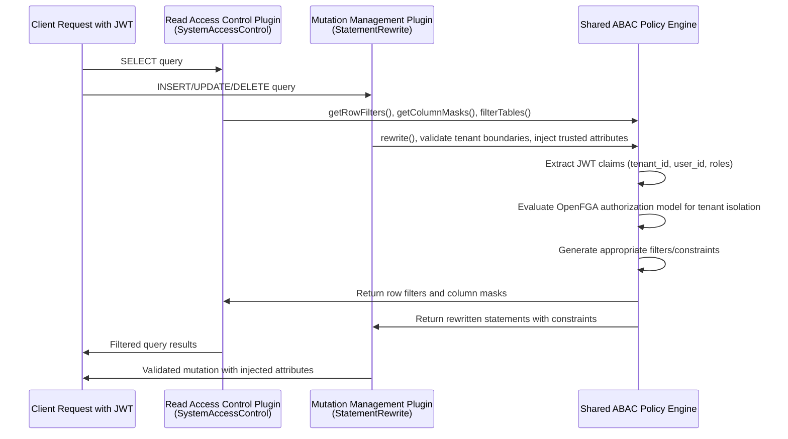
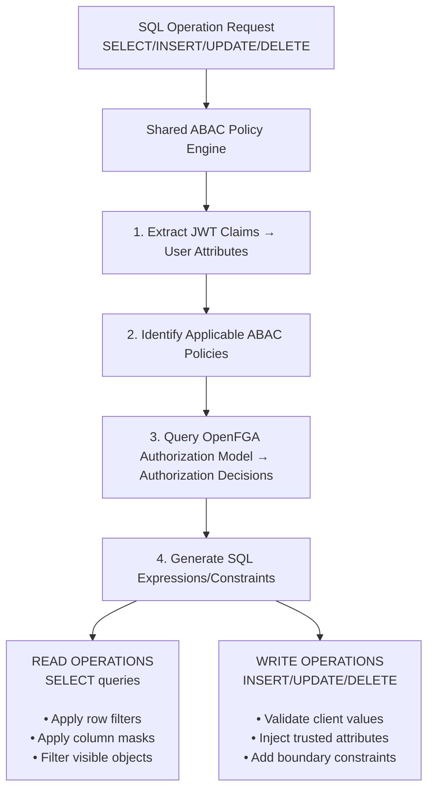

# Relationship-Based Access Control (ReBAC) Patterns for Write Operations

## Overview

This document outlines **Relationship-Based Access Control (ReBAC)** patterns for write operations that integrate with OpenFGA's authorization model. ReBAC is OpenFGA's primary access control model, where authorization decisions are based on relationships between users and objects.

**Key ReBAC Concepts:**

- **Primary Model**: ReBAC enables access rules based on user-object relationships and object-object relationships
- **RBAC Integration**: Role-Based Access Control is a subset of ReBAC (roles are relationships)
- **ABAC Support**: Attribute-Based Access Control scenarios are handled through OpenFGA Conditions and Contextual Tuples
- **PBAC Nature**: ReBAC can be considered Policy-Based Access Control since authorization policies are centralized

**Multi-tenancy** is presented as a primary example of ReBAC relationship patterns, implemented through tenant membership relationships rather than simple attribute matching.

## ReBAC Integration with Trusted Attribute Injection

OpenFGA's ReBAC authorization model integrates with the **Trusted Attribute Injection framework** to support relationship-based access control:

1. **Relationship-based authorization** - Users authorized based on relationships (tenant membership, role assignments, ownership, group membership)
2. **Contextual attributes for conditions** - OpenFGA Conditions use attributes from JWT claims, database lookups, and other sources for ABAC scenarios
3. **Relationship tuple management** - Framework helps construct and manage OpenFGA relationship tuples using injected attributes
4. **Cross-operation consistency** - Same relationship model applies to both read operations (row filters) and write operations (boundary constraints)
5. **Performance optimization** - Multi-layer caching for both relationship lookups and attribute resolution

## Dual-Plugin Architecture for ReBAC

The **separation of concerns** approach provides clean ReBAC enforcement with OpenFGA integration:



### Why This Architecture Works for ReBAC

**✅ Relationship-First Design**: ReBAC uses OpenFGA's native relationship model as the primary authorization mechanism
**✅ OpenFGA Integration**: Direct integration with OpenFGA Check API and relationship tuple management
**✅ ABAC When Needed**: Supports ABAC scenarios through OpenFGA Conditions and Contextual Tuples
**✅ Attribute Support**: Trusted Attribute Injection provides attributes needed for OpenFGA Conditions and tuple construction
**✅ Policy Consistency**: Same relationship model applies to both read operations (row filters) and write operations (boundary constraints)
**✅ Performance Optimization**: Multi-layer caching for both OpenFGA calls and attribute resolution
**✅ Standards Compliance**: Aligns with OpenFGA's ReBAC model rather than imposing external ABAC abstractions

## ReBAC with OpenFGA Conditions for ABAC Use Cases

### Relationship and Attribute Configuration

OpenFGA ReBAC relationships and ABAC Conditions reference attributes configured in the **[Trusted Attribute Injection](trusted-attribute-injection.md)** framework:

**Multi-Tenancy Security Attributes:**

```yaml
# /etc/trino/attribute-injection.yaml
attributes:
  tenant_id:
    type: varchar
    provider: jwt_claims
    config:
      claim_path: "tenant_id"
      required: true
    cache: session

  user_department:
    type: varchar
    provider: database_lookup
    config:
      query: "SELECT department FROM users WHERE username = ?"
    cache: session

  authorized_regions:
    type: array<varchar>
    provider: jwt_claims
    config:
      claim_path: "authorized_regions"
    cache: session
```

**Security Clearance Attributes:**

```yaml
attributes:
  security_clearance:
    type: int
    provider: database_lookup
    config:
      query: "SELECT clearance_level FROM security_clearances WHERE user_id = ?"
    cache: session

  clearance_expiry:
    type: timestamp
    provider: database_lookup
    config:
      query: "SELECT expires_at FROM security_clearances WHERE user_id = ?"
    cache: session
```

**Temporal Access Control Attributes:**

```yaml
attributes:
  current_time:
    type: timestamp
    provider: computed
    config:
      expression: "now()"
    cache: none

  business_hours_only:
    type: boolean
    provider: computed
    config:
      expression: "hour(now()) >= 9 AND hour(now()) <= 17"
    cache: query
```

## Multi-Tenancy as a ReBAC Relationship Pattern

Multi-tenancy in OpenFGA is implemented through **relationship tuples** that establish tenant membership relationships. While attributes are still used for efficiency, the authorization model is based on relationships, with ABAC support through OpenFGA Conditions when needed.

### Multi-Tenancy ReBAC Configuration

**OpenFGA Authorization Model for Multi-Tenancy:**

```yaml
# OpenFGA Authorization Model for Multi-Tenancy
model: |
  model
    schema 1.1
  type tenant
    relations
      define member: [user]
      define admin: [user]
      define viewer: [user] or member
  type dataset
    relations
      define tenant: [tenant]
      define viewer: [user] or viewer from tenant
      define editor: [user] or member from tenant
      define admin: [user] or admin from tenant

# Relationship Tuples (examples)
tuples:
  - user: user:alice
    relation: member
    object: tenant:acme_corp
  - user: user:bob
    relation: admin
    object: tenant:acme_corp
  - object: dataset:sales_data
    relation: tenant
    object: tenant:acme_corp
```

**Authorization Queries (using OpenFGA Check API):**

```
# Check if user alice can view sales_data
check(user:alice, viewer, dataset:sales_data)
# Resolves through: alice is member of tenant:acme_corp, and sales_data's tenant is acme_corp

# Check if user bob can edit sales_data
check(user:bob, editor, dataset:sales_data)
# Resolves through: bob is member of tenant:acme_corp, and members have edit access
```

### ReBAC Policy Engine Integration

The **Shared Policy Engine** handles multi-tenancy through OpenFGA's ReBAC model:

```java
public class SharedReBACPolicyEngine {

    public List<ViewExpression> getRowFilters(SecurityContext context, CatalogSchemaTableName table) {
        List<ViewExpression> filters = new ArrayList<>();

        // Apply OpenFGA relationship-based authorization
        for (RelationshipRule rule : getApplicableRelationshipRules(context, table)) {
            // Check relationships via OpenFGA Check API
            boolean hasAccess = openFGAClient.check(
                context.getIdentity().getUser(),
                rule.getRequiredRelation(),
                formatObjectId(table)
            ).get();

            if (!hasAccess) {
                // Generate relationship-based filter
                ViewExpression filter = generateRelationshipFilter(rule, context, table);
                if (filter != null) {
                    filters.add(filter);
                }
            }
        }

        return filters;
    }

    public List<AttributeInjectionRule> getAttributeInjectionRules(CatalogSchemaTableName table) {
        // Return attribute injection rules for OpenFGA relationship tuple construction
        return relationshipConfigService.getInjectionRules(table);
    }

    private ViewExpression generateRelationshipFilter(RelationshipRule rule,
                                            SecurityContext context,
                                            CatalogSchemaTableName table) {

        // For multi-tenancy policy: generate "tenant_id = ${user.tenant_id}"
        // For role-based policy: generate "department = ${user.department}"
        // For clearance policy: generate "security_level <= ${user.clearance}"

        return policyEvaluator.generateFilterExpression(policy, context);
    }
}
```

## Additional ReBAC Patterns with Optional ABAC Conditions

### Role-Based Access Control (RBAC) through ReBAC

```yaml
# Role-based access control configuration
abac_policies:
  rbac:
    enabled: true

    # Attribute definitions
    role_attribute:
      name: "role"
      source: JWT_CLAIM
      jwt_claim: "role"
      required: true

    department_attribute:
      name: "department"
      source: JWT_CLAIM
      jwt_claim: "department"

    # Read policies
    read_policies:
      "hr.employees":
        filter: "${user.department} = 'HR' OR ${user.role} IN ('admin', 'hr_manager')"

      "finance.salary":
        filter: "${user.role} IN ('admin', 'finance_manager') OR (${user.department} = 'finance' AND ${user.role} = 'finance_analyst')"

    # Write policies
    write_policies:
      attribute_injection:
        modified_by:
          source: JWT_CLAIM
          strategy: FORCE_INJECT
          jwt_claim: "sub"

        modification_date:
          source: COMPUTED
          strategy: FORCE_INJECT
          computation: "CURRENT_TIMESTAMP"

      validation_constraints:
        "hr.employees":
          - "${user.role} IN ('admin', 'hr_manager')"

        "finance.salary":
          - "${user.role} IN ('admin', 'finance_manager')"
```

### Security Clearance-Based Access (Hierarchical ABAC)

```yaml
# Security clearance access control
abac_policies:
  security_clearance:
    enabled: true

    # Clearance levels (hierarchical)
    clearance_levels:
      PUBLIC: 1
      INTERNAL: 2
      CONFIDENTIAL: 3
      SECRET: 4
      TOP_SECRET: 5

    # Attribute definitions
    user_clearance:
      name: "security_clearance"
      source: JWT_CLAIM
      jwt_claim: "security_clearance"
      required: true

    # Read policies - users can read data at or below their clearance level
    read_policies:
      default_filter: "data_classification_level <= ${user.security_clearance_level}"

    # Write policies - ensure proper classification
    write_policies:
      validation_constraints:
        - "data_classification_level <= ${user.security_clearance_level}"

      attribute_injection:
        classified_by:
          source: JWT_CLAIM
          strategy: FORCE_INJECT
          jwt_claim: "sub"

        classification_date:
          source: COMPUTED
          strategy: FORCE_INJECT
          computation: "CURRENT_TIMESTAMP"
```

### Geographic Data Residency (Location-Based ABAC)

```yaml
# Geographic access control
abac_policies:
  geographic_residency:
    enabled: true

    # User location attributes
    user_location:
      name: "authorized_regions"
      source: JWT_CLAIM
      jwt_claim: "authorized_regions"  # Array of region codes
      required: true

    # Read policies
    read_policies:
      default_filter: "data_region IN (${user.authorized_regions})"

    # Write policies
    write_policies:
      attribute_injection:
        data_region:
          source: DATABASE_LOOKUP
          strategy: VALIDATE_MATCH
          lookup_query: "SELECT region FROM regions WHERE region_code = ${client.data_region} AND region_code IN (${user.authorized_regions})"

      validation_constraints:
        - "data_region IN (${user.authorized_regions})"
```

## Multi-Tenancy Implementation Example

The following example demonstrates how multi-tenancy (as a specific ABAC use case) is implemented using the **dual-plugin architecture** with **shared policy engine**.

### Multi-Tenancy Architecture Flow



### Configuration Example

```yaml
# Unified ABAC configuration covering both read and write operations
abac_policies:
  multi_tenancy:
    enabled: true

    # Read operations (handled by SystemAccessControl plugin)
    read_filters:
      default: "tenant_id = ${jwt.tenant_id}"
      exceptions:
        "audit.system_logs": "tenant_id = ${jwt.tenant_id} OR ${jwt.role} = 'admin'"
        "global.configuration": "true"  # No tenant filtering

    # Write operations (handled by StatementRewrite plugin)
    write_policies:
      trusted_attributes:
        tenant_id:
          source: JWT_CLAIM
          jwt_claim: "tenant_id"
          strategy: FORCE_INJECT

        created_by:
          source: JWT_CLAIM
          jwt_claim: "sub"
          strategy: FORCE_INJECT

      boundary_constraints:
        default: "tenant_id = ${jwt.tenant_id}"
        exceptions:
          "audit.system_logs": "tenant_id = ${jwt.tenant_id} OR ${jwt.role} = 'admin'"
          "global.configuration": "${jwt.role} = 'admin'"
```

### SQL Transformation Examples (via StatementRewrite)

**Read Operation Filtering (SystemAccessControl Plugin):**

```sql
-- Client query
SELECT * FROM orders WHERE amount > 100;

-- Automatically filtered by getRowFilters()
SELECT * FROM orders WHERE amount > 100 AND tenant_id = 'tenant_abc';
```

**Write Operation Rewriting (StatementRewrite Plugin):**

**INSERT with Trusted Attribute Injection:**

```sql
-- Original INSERT (client)
INSERT INTO orders (customer_id, amount, order_date)
VALUES (123, 99.99, '2024-01-15');

-- Rewritten by StatementRewrite Plugin
INSERT INTO orders (customer_id, amount, order_date, tenant_id, created_by, created_at)
VALUES (123, 99.99, '2024-01-15', 'tenant_abc', 'user123', CURRENT_TIMESTAMP);
```

**INSERT with Validation Failure:**

```sql
-- Malicious INSERT (client trying to access wrong tenant)
INSERT INTO orders (customer_id, amount, tenant_id)
VALUES (123, 99.99, 'tenant_xyz');

-- StatementRewrite validation fails with:
-- AccessDeniedException: Cannot insert data for tenant 'tenant_xyz' - user belongs to tenant 'tenant_abc'
```

**UPDATE with Boundary Enforcement:**

```sql
-- Original UPDATE (client)
UPDATE orders SET amount = 109.99 WHERE order_id = 456;

-- Rewritten by StatementRewrite Plugin
UPDATE orders SET amount = 109.99
WHERE order_id = 456 AND tenant_id = 'tenant_abc';
```

**DELETE with Tenant Isolation:**

```sql
-- Original DELETE (client)
DELETE FROM orders WHERE order_id = 456;

-- Rewritten by StatementRewrite Plugin
DELETE FROM orders
WHERE order_id = 456 AND tenant_id = 'tenant_abc';
```

## ABAC Implementation Framework

This general framework supports any attribute-based access control scenario, from simple multi-tenancy to complex security clearance systems. The **dual-plugin architecture** ensures consistent ABAC enforcement across all SQL operations.

### Unified ABAC Configuration Pattern

```yaml
# General ABAC configuration template
abac_policies:
  policy_name:
    enabled: true

    # User attribute definitions
    user_attributes:
      primary_attribute:
        name: "attribute_name"
        source: JWT_CLAIM | DATABASE_LOOKUP | CONFIG_LOOKUP
        reference: "jwt_claim_name" | "lookup_query" | "config_key"
        required: true | false

    # Read access control (SystemAccessControl Plugin)
    read_policies:
      default_filter: "SQL expression using ${user.attributes}"
      table_overrides:
        "catalog.schema.table": "custom filter expression"

    # Write access control (StatementRewrite Plugin)
    write_policies:
      # Automatic attribute injection
      trusted_attributes:
        attribute_name:
          source: JWT_CLAIM | COMPUTED | DATABASE_LOOKUP
          strategy: FORCE_INJECT | INJECT_IF_MISSING
          reference: "source reference"

      # Validation constraints
      boundary_constraints:
        default: "SQL constraint expression"
        table_overrides:
          "catalog.schema.table": "custom constraint"

      # Client value validation
      client_validation:
        column_name:
          validation_type: DATABASE_QUERY | OPENFGA_CHECK | EXPRESSION
          validation_rule: "validation logic"
```

### ABAC Policy Evaluation Flow



For detailed implementation of the **StatementRewrite-based mutation management**, see **[Mutation Management Plugin](mutation-management-plugin.md)**.

## Performance and Configuration

### Performance Considerations

**ABAC Policy Evaluation Overhead:**

- JWT claims extraction: ~1-2ms per request
- OpenFGA authorization check: ~5-20ms per check (including network)
- SQL expression generation: ~1-3ms per filter/constraint

**Optimization Strategies:**

- **Shared Policy Engine**: Single policy evaluation shared between both plugins
- **Multi-layer Caching**: Session, user, and policy-level caching (see [Performance Optimization](performance-optimization.md))
- **Authorization Model Caching**: Pre-load and cache OpenFGA authorization model for faster evaluation
- **Batch Operations**: Batch multiple authorization checks for complex queries

### Configuration Integration

ABAC policies integrate with the existing OpenFGA plugin configuration:

```properties
# Enable ABAC framework
openfga.abac.enabled=true
openfga.abac.config.file=/etc/trino/abac-policies.yaml

# Multi-tenancy specific (example ABAC use case)
openfga.abac.multi_tenancy.enabled=true
openfga.abac.multi_tenancy.tenant_claim=tenant_id

# JWT integration for attribute extraction
openfga.jwt.enabled=true
openfga.jwt.validation.issuer=https://auth.example.com
openfga.jwt.validation.audience=trino-cluster

# Performance optimization
openfga.abac.cache.enabled=true
openfga.abac.policy.compilation.enabled=true
```
