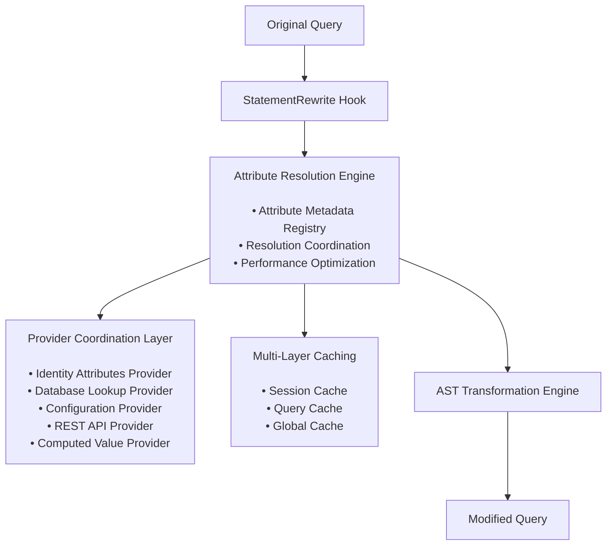
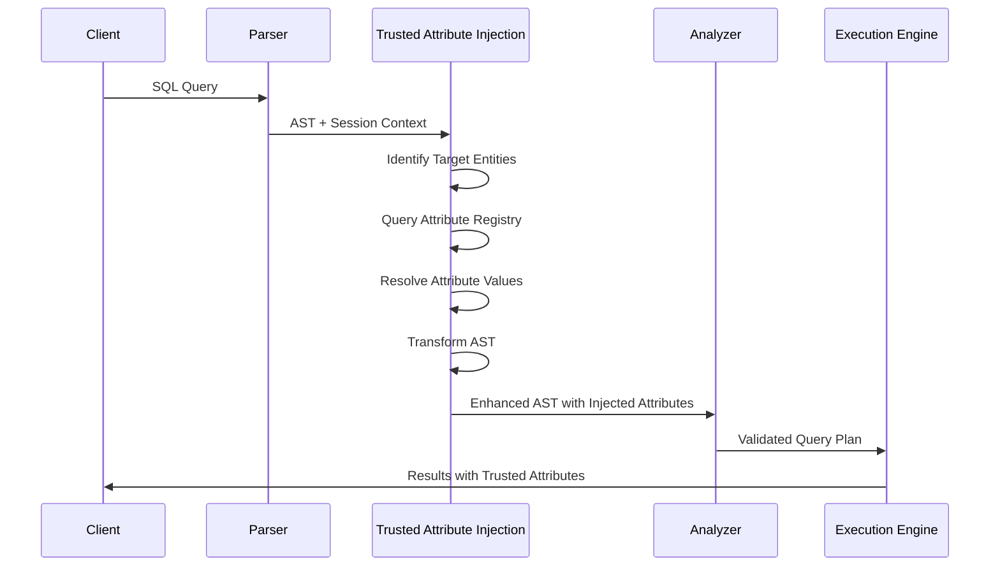

# Trusted Attribute Injection Framework

## Overview

The Trusted Attribute Injection framework is a **foundational, general-purpose capability** for automatically injecting trusted attributes into Trino queries from configurable sources. This framework supports multiple use cases including security (OpenFGA ReBAC authorization), auditing, compliance, data governance, and query enrichment.

## Core Architecture

### Framework Components



**SQL Transformation Example**:

```sql
-- Original Query (from client)
INSERT INTO assets (name, type)
VALUES ('server-1', 'compute')
```

```sql
-- Modified Query (after schema-driven attribute injection)
-- All attribute names and values come from external configuration:
INSERT INTO assets (name, type, {{attr_1.name}}, {{attr_2.name}}, {{attr_3.name}})
VALUES ('server-1', 'compute', {{attr_1.value}}, {{attr_2.value}}, {{attr_3.value}})

-- Configuration-driven results (examples of possible configurations):
-- Multi-tenancy: INSERT INTO assets (name, type, tenant_id, created_by, created_at)
-- Healthcare: INSERT INTO assets (name, type, facility_id, patient_group, compliance_flag)
-- Financial: INSERT INTO assets (name, type, trading_desk, risk_level, audit_id)
-- Government: INSERT INTO assets (name, type, clearance_level, department_id, classification)
```

### Key Principles

1. **General-Purpose Design**: Framework supports any attribute injection use case, not just security
2. **Configuration-Driven**: Attributes defined declaratively with configurable source mappings
3. **Provider-Based Architecture**: Pluggable providers for different attribute sources
4. **Performance Optimization**: Multi-layer caching and batch resolution
5. **Security-Aware**: Attribute access control and audit logging built-in

## Integration with Trino Query Pipeline

### StatementRewrite Integration Point

**Integration Point**: The framework uses StatementRewrite for attribute injection because it provides:

- Positioned **after parsing** but **before semantic analysis**
- Full AST (Abstract Syntax Tree) access and modification capability
- Access to Session context (user identity, credentials, properties)
- Can add columns, predicates, and expressions before type checking

### Query Processing Flow



## Attribute Provider SPI

### Provider Interface

```java
public interface AttributeProvider {
    /**
     * Provider identification
     */
    String getName();
    Set<String> getSupportedAttributeTypes();

    /**
     * Async attribute resolution
     */
    CompletableFuture<Map<String, Object>> resolveAttributes(
        AttributeResolutionContext context,
        Set<AttributeDefinition> requestedAttributes
    );

    /**
     * Provider capabilities
     */
    boolean supports(AttributeDefinition attribute);
    Duration getTypicalResolutionTime();
    boolean supportsBatchResolution();
}

public class AttributeResolutionContext {
    private final Session session;
    private final Identity identity;
    private final QueryId queryId;
    private final Set<CatalogSchemaTableName> targetTables;
    private final Map<String, Object> sessionAttributes;
}
```

### Built-in Providers

#### Identity Attributes Provider

Extracts attributes from user identity across all Trino authentication methods (JWT, OAuth2, Kerberos, LDAP, Certificate, Header, Password):

```java
public class IdentityAttributesProvider implements AttributeProvider {

    @Override
    public CompletableFuture<Map<String, Object>> resolveAttributes(
            AttributeResolutionContext context,
            Set<AttributeDefinition> requestedAttributes) {

        Identity identity = context.getSession().getIdentity();

        // Handle JWT/OAuth2 authentication
        if (identity.getPrincipal().isPresent() &&
            identity.getPrincipal().get() instanceof JwtPrincipal) {
            return extractJwtClaims((JwtPrincipal) identity.getPrincipal().get(),
                                  requestedAttributes);
        }

        // Handle other authentication methods via Identity properties
        return extractIdentityAttributes(identity, requestedAttributes);
    }

    private CompletableFuture<Map<String, Object>> extractIdentityAttributes(
            Identity identity, Set<AttributeDefinition> requestedAttributes) {
        Map<String, Object> attributes = new HashMap<>();

        // Universal identity attributes available from all auth methods
        attributes.put("user", identity.getUser());
        attributes.put("groups", identity.getGroups());
        attributes.put("roles", identity.getRoles());

        // Extract additional attributes from identity extras/properties
        for (AttributeDefinition attr : requestedAttributes) {
            extractFromIdentityExtras(identity, attr, attributes);
        }

        return CompletableFuture.completedFuture(attributes);
    }
}
```

**Generic Configuration Schema for All Authentication Methods:**

```yaml
# Attribute Schema Definition - Organizations define their own attribute names
# Framework supports any attribute name/source combination
attribute_schema:
  attribute_sources:
    # Schema-driven identity provider - works with ALL Trino auth methods
    identity_provider:
      type: "identity_attributes"
      supports: ["jwt_claims", "ldap_attributes", "identity_fields", "extra_credentials"]

    # Schema-driven external providers
    database_provider:
      type: "database_lookup"
      supports: ["sql_queries", "batch_resolution"]

    computed_provider:
      type: "computed_values"
      supports: ["expressions", "functions", "templates"]

# Example configurations (attribute names are organization-specific):
attribute_definitions:
  # Multi-tenancy use case example
  isolation_attribute:  # Organization defines name (could be tenant_id, account_id, etc.)
    provider: identity_provider
    source_config:
      type: "jwt_claims"
      path: "custom.tenant_identifier"  # JWT claim path
      required: true
    cache_policy: "session"

  # Healthcare use case example
  facility_access:  # Organization defines name (could be facility_id, location, etc.)
    provider: identity_provider
    source_config:
      type: "ldap_attributes"
      attribute: "healthcareFacility"  # LDAP attribute
      default: "none"
    cache_policy: "session"

  # Government use case example
  security_level:  # Organization defines name (could be clearance_level, classification, etc.)
    provider: database_provider
    source_config:
      query: "SELECT clearance FROM user_security WHERE username = ?"
      result_field: "clearance"
      timeout: "5s"
    cache_policy: "session"

  # Audit use case example
  audit_context:  # Organization defines name (could be tracking_id, session_info, etc.)
    provider: computed_provider
    source_config:
      expression: "json_object('user', identity.user, 'timestamp', now())"
    cache_policy: "query"
```

#### Database Lookup Provider

Queries external databases for attribute values:

```java
public class DatabaseLookupProvider implements AttributeProvider {

    @Override
    public CompletableFuture<Map<String, Object>> resolveAttributes(
            AttributeResolutionContext context,
            Set<AttributeDefinition> requestedAttributes) {

        String username = context.getIdentity().getUser();

        // Batch multiple attribute lookups into single query
        String sql = buildBatchQuery(requestedAttributes);

        return queryExecutor.executeAsync(sql, username)
            .thenApply(this::parseResults);
    }
}
```

**Generic Configuration Schema:**
```yaml
# Schema-driven database lookups - attribute names defined by organization
database_attribute_definitions:
  # Government/Defense use case
  {org_security_attr}:  # Organization defines: security_clearance, classification_level, etc.
    provider: database_lookup
    config:
      datasource: "{org_datasource_name}"
      query: "SELECT {org_result_field} FROM {org_table} WHERE username = ?"
      result_column: "{org_result_field}"
    cache: session

  # Geographic/Regional use case
  {org_location_attr}:  # Organization defines: authorized_regions, locations, territories, etc.
    provider: database_lookup
    config:
      datasource: "{org_datasource_name}"
      query: "SELECT {org_location_field} FROM {org_location_table} WHERE username = ?"
      result_column: "{org_location_field}"
      multi_value: true
    cache: session

# Example concrete configurations (showing flexibility):
example_configurations:
  # Healthcare organization
  healthcare_facility_access:
    provider: database_lookup
    config:
      datasource: "hcm_user_db"
      query: "SELECT facility_code FROM provider_facilities WHERE provider_id = ?"
      result_column: "facility_code"
      multi_value: true

  # Financial services
  trading_desk_authorization:
    provider: database_lookup
    config:
      datasource: "risk_management_db"
      query: "SELECT desk_code FROM trader_assignments WHERE employee_id = ?"
      result_column: "desk_code"
```

#### Configuration File Provider

Loads attributes from configuration files:

```yaml
# Generic configuration file schema - attribute names defined by organization
config_file_attributes:
  {org_retention_policy}:  # Organization defines: data_retention_days, retention_period, archive_schedule, etc.
    provider: config_file
    config:
      file: "/etc/trino/{org_policy_file}"
      key_path: "{org_config_path}"
    cache: global

  {org_compliance_data}:  # Organization defines: compliance_tags, regulatory_flags, audit_requirements, etc.
    provider: config_file
    config:
      file: "/etc/trino/{org_compliance_file}"
      key_path: "{org_compliance_path}"
    cache: global

# Example configurations for different industries:
example_file_configurations:
  # Healthcare compliance
  hipaa_data_classification:
    provider: config_file
    config:
      file: "/etc/trino/hipaa-config.yaml"
      key_path: "classification.default_level"

  # Financial regulations
  sox_audit_requirements:
    provider: config_file
    config:
      file: "/etc/trino/financial-compliance.yaml"
      key_path: "sox.audit_flags"
```

#### REST API Provider

Fetches attributes from external REST APIs:

```yaml
# Generic REST API schema - attribute names defined by organization
rest_api_attributes:
  {org_authorization_data}:  # Organization defines: user_permissions, access_rights, entitlements, etc.
    provider: rest_api
    config:
      url: "https://{org_auth_service}/api/users/{username}/{org_endpoint}"
      method: "GET"
      headers:
        Authorization: "Bearer ${org_service_token}"
      timeout: "{org_timeout}"
    cache: session

# Example REST API configurations:
example_api_configurations:
  # Enterprise identity provider
  active_directory_groups:
    provider: rest_api
    config:
      url: "https://graph.microsoft.com/v1.0/users/{username}/memberOf"
      method: "GET"
      headers:
        Authorization: "Bearer ${azure_token}"

  # Custom authorization service
  business_unit_access:
    provider: rest_api
    config:
      url: "https://authz.company.com/api/user-entitlements/{username}"
      method: "GET"
```

#### Computed Value Provider

Generates attributes using configurable expressions:

```yaml
# Generic computed value schema - attribute names defined by organization
computed_attributes:
  {org_timestamp_attr}:  # Organization defines: current_timestamp, access_time, audit_timestamp, etc.
    provider: computed
    config:
      expression: "now()"
    cache: none

  {org_query_tracking}:  # Organization defines: query_hash, request_id, session_fingerprint, etc.
    provider: computed
    config:
      expression: "sha256(${query_text})"
    cache: query

  {org_session_identifier}:  # Organization defines: session_id, tracking_token, correlation_id, etc.
    provider: computed
    config:
      expression: "uuid()"
    cache: session

# Example computed configurations:
example_computed_configurations:
  # Audit trail generation
  compliance_audit_context:
    provider: computed
    config:
      expression: "json_object('user', identity.user, 'timestamp', now(), 'query_id', query.id)"

  # Data lineage tracking
  data_access_fingerprint:
    provider: computed
    config:
      expression: "concat('access_', sha256(concat(identity.user, query.tables, now())))"
```

## Attribute Resolution Engine

### Multi-Source Coordination

```java
public class AttributeResolutionEngine {
    private final Map<String, AttributeProvider> providers;
    private final AttributeCache cache;
    private final AttributeRegistry registry;

    public CompletableFuture<Map<String, Object>> resolveAttributes(
            AttributeResolutionContext context,
            Set<String> requestedAttributes) {

        // 1. Check cache first
        Map<String, Object> cachedAttributes = cache.get(context, requestedAttributes);
        Set<String> uncachedAttributes = Sets.difference(requestedAttributes, cachedAttributes.keySet());

        if (uncachedAttributes.isEmpty()) {
            return CompletableFuture.completedFuture(cachedAttributes);
        }

        // 2. Group attributes by provider
        Map<AttributeProvider, Set<AttributeDefinition>> attributesByProvider =
            groupAttributesByProvider(uncachedAttributes);

        // 3. Resolve in parallel
        List<CompletableFuture<Map<String, Object>>> futures = attributesByProvider.entrySet()
            .stream()
            .map(entry -> entry.getKey().resolveAttributes(context, entry.getValue()))
            .collect(toList());

        // 4. Combine results and cache
        return CompletableFuture.allOf(futures.toArray(new CompletableFuture[0]))
            .thenApply(v -> {
                Map<String, Object> resolvedAttributes = futures.stream()
                    .map(CompletableFuture::join)
                    .flatMap(map -> map.entrySet().stream())
                    .collect(toMap(Map.Entry::getKey, Map.Entry::getValue));

                // Cache resolved attributes
                cache.put(context, resolvedAttributes);

                // Combine with cached attributes
                Map<String, Object> allAttributes = new HashMap<>(cachedAttributes);
                allAttributes.putAll(resolvedAttributes);

                return allAttributes;
            });
    }
}
```

### Caching Strategy

**Multi-Layer Caching Architecture:**

```java
public interface AttributeCache {

    // Session-level cache (attributes valid for entire user session)
    Optional<Object> getSessionAttribute(String username, String attributeName);
    void putSessionAttribute(String username, String attributeName, Object value, Duration ttl);

    // Query-level cache (attributes valid for single query)
    Optional<Object> getQueryAttribute(QueryId queryId, String attributeName);
    void putQueryAttribute(QueryId queryId, String attributeName, Object value);

    // Global cache (attributes valid across all sessions)
    Optional<Object> getGlobalAttribute(String attributeName);
    void putGlobalAttribute(String attributeName, Object value, Duration ttl);
}
```

**Caching Policies:**

- **Session Cache**: User attributes from identity (JWT claims, LDAP attributes, etc.), database queries (TTL: 15-60 minutes)
- **Query Cache**: Computed values, query-specific attributes (TTL: query duration)
- **Global Cache**: Configuration values, static lookup data (TTL: hours to days)

## Query Transformation

### AST Modification

The framework transforms the AST to inject attributes before semantic analysis:

```java
public class AttributeInjectionRewrite implements Rewrite {

    @Override
    public Statement rewrite(
            AnalyzerFactory analyzerFactory,
            Session session,
            Statement node,
            List<Expression> parameters,
            Map<NodeRef<Parameter>, Expression> parameterLookup,
            WarningCollector warningCollector,
            PlanOptimizersStatsCollector planOptimizersStatsCollector) {

        // 1. Identify target entities (tables, views, etc.)
        Set<CatalogSchemaTableName> targetTables = extractTargetTables(node);

        // 2. Determine applicable attributes
        Set<String> applicableAttributes = registry.getApplicableAttributes(targetTables, session);

        // 3. Resolve attribute values
        AttributeResolutionContext context = new AttributeResolutionContext(session, targetTables);
        Map<String, Object> attributes = resolutionEngine.resolveAttributes(context, applicableAttributes).join();

        // 4. Transform AST to inject attributes
        return AttributeInjectionVisitor.transform(node, attributes);
    }
}
```

### Injection Patterns

#### Column Addition

Transform `SELECT *` to include configured attributes:

```sql
-- Original Query
SELECT * FROM assets

-- Transformed Query (attribute names/values configured per deployment)
SELECT *,
       {resolved_value_1} AS {configured_attr_1},
       {resolved_value_2} AS {configured_attr_2},
       {resolved_value_3} AS {configured_attr_3}
FROM assets

-- Example configuration result:
-- SELECT *, 'tenant_123' AS tenant_id, 3 AS clearance_level, CURRENT_TIMESTAMP AS access_time FROM assets
```

#### Predicate Injection

```sql
-- OPEN ISSUE: This requires SystemAccessControl integration with injected attributes.
-- The mechanism for referencing configured attribute names in row filters
-- is not yet designed for general-purpose use.

-- Conceptual example (attribute names configured per deployment):
-- SELECT * FROM sensitive_data
-- WHERE {configured_isolation_attr} = {resolved_isolation_value}
--   AND {configured_access_attr} <= {resolved_access_value}
```

#### Security Attribute Injection

Automatically inject trusted security attributes to prevent privilege escalation by untrusted clients:

```sql
-- Original Query (from untrusted client)
INSERT INTO assets (name, type, status)
VALUES ('server-1', 'compute', 'active')

-- Transformed Query (system adds security attributes based on auth token)
INSERT INTO assets (name, type, status, tenant_id, created_by, created_at)
VALUES ('server-1', 'compute', 'active', 'tenant_123', 'alice', CURRENT_TIMESTAMP)
```

## Configuration Schema

### Generic Attribute Schema Configuration

```yaml
# /etc/trino/attribute-injection.yaml - Schema-driven configuration
attribute_injection:
  enabled: true

  # Global framework settings
  performance:
    resolution_timeout: "10s"
    cache_enabled: true
    batch_resolution: true

  # Schema-driven attribute definitions (attribute names defined by organization)
  attribute_schema:
    # Multi-tenancy isolation attribute (organization chooses name)
    {org_isolation_attribute}:  # Could be: tenant_id, account_id, organization_id, workspace_id, etc.
      type: varchar
      provider: identity_attributes
      config:
        source: "jwt_claims"
        claim_path: "{org_jwt_claim_path}"  # Organization's JWT claim structure
        required: true
      cache: session
      access_control:
        - "role:{org_admin_role}"
        - "role:{org_security_role}"

    # Authorization level attribute (organization chooses name)
    {org_authorization_level}:  # Could be: security_clearance, access_level, permission_tier, etc.
      type: int
      provider: database_lookup
      config:
        datasource: "{org_datasource}"
        query: "SELECT {org_level_column} FROM {org_user_table} WHERE {org_user_key} = ?"
        result_column: "{org_level_column}"
        timeout: "5s"
      cache: session
      fallback: {org_default_level}

    # Metadata tracking attribute (organization chooses name)
    {org_metadata_attribute}:  # Could be: data_source, access_context, lineage_info, etc.
      type: varchar
      provider: computed
      config:
        expression: "'{org_expression_template}'"  # Organization's metadata expression
      cache: query

    # Compliance attribute (organization chooses name)
    {org_compliance_attribute}:  # Could be: compliance_labels, regulatory_tags, audit_flags, etc.
      type: array<varchar>
      provider: rest_api
      config:
        url: "{org_compliance_api_url}"
        method: "GET"
        timeout: "3s"
      cache: session
      fallback: []

  # Provider configurations
  providers:
    database_lookup:
      hr_db:
        connection_url: "jdbc:postgresql://hr.company.com/employees"
        username: "${HR_DB_USER}"
        password: "${HR_DB_PASSWORD}"
        max_connections: 10

    rest_api:
      default_headers:
        User-Agent: "Trino-Attribute-Injection/1.0"
      default_timeout: "5s"
      retry_policy:
        max_attempts: 3
        backoff: "exponential"
```

### Access Control Policies

Control which users/roles can access which attributes:

```yaml
access_control:
  attributes:
    sensitive_security_clearance:
      allowed_roles: ["security_officer", "admin"]
      audit: true

    internal_project_codes:
      allowed_groups: ["employees"]
      denied_groups: ["contractors"]

    pii_access_level:
      custom_policy: "user.department IN ('HR', 'Legal') OR user.role = 'admin'"
```

## Use Case Examples

### Security/ReBAC Authorization

**Scenario**: Multi-tenant ReBAC system needs tenant isolation through relationship-based access control

```yaml
attributes:
  tenant_id:
    provider: identity_attributes
    config:
      source: "jwt_claims"
      claim_path: "tenant_id"
```

**Usage in OpenFGA ReBAC Authorization**:

```yaml
# OpenFGA Authorization Model
authorization_model: |
  type user
  type tenant
    relations
      define member: [user]
  type dataset
    relations
      define tenant: [tenant]
      define viewer: [user] or member from tenant

# Relationship Tuples (created using injected tenant_id)
tuples:
  - user: user:alice
    relation: member
    object: tenant:tenant_abc

# Authorization Check
check(user:alice, viewer, dataset:orders)
# Uses injected tenant_id to verify dataset belongs to user's tenant
```

**Generated SQL**:

```sql
-- Row filter applied by SystemAccessControl
WHERE tenant_id = 'tenant_abc'
```

### Auditing and Compliance

**Scenario**: Automatically track all data access for compliance

```yaml
attributes:
  audit_context:
    provider: computed
    config:
      expression: "json_object('user', '${user}', 'query_id', '${query_id}', 'timestamp', now())"
```

**Usage**: Automatically injected into audit tables:

```sql
-- Original Query
SELECT * FROM customer_data

-- Transformed for Auditing
SELECT *,
       '{"user":"alice","query_id":"20241110_123456","timestamp":"2024-11-10T13:45:00Z"}' AS audit_context
FROM customer_data
```

### Data Governance

**Scenario**: Track data lineage and classification

```yaml
attributes:
  data_lineage_tags:
    provider: database_lookup
    config:
      query: "SELECT tags FROM data_catalog WHERE table_name = ?"

  classification_level:
    provider: rest_api
    config:
      url: "https://datacatalog.company.com/api/classification/{catalog}/{schema}/{table}"
```

### Query Enrichment

**Scenario**: Add computed metadata to all queries

```yaml
attributes:
  query_metadata:
    provider: computed
    config:
      expression: "json_object('region', '${session.region}', 'cost_center', '${user.cost_center}')"
```

## Performance Optimization

### Caching Strategy

Multi-layer caching reduces attribute resolution overhead (performance targets require benchmarking during implementation):

- **Session Cache**: Attributes resolved once per session
- **Query Cache**: Attributes resolved once per query execution
- **Global Cache**: Shared attributes across sessions

### Batch Resolution

Optimize multiple attribute resolution:

```java
// Instead of individual calls:
getAttribute("configured_attr_1");     // Network round-trip 1
getAttribute("configured_attr_2");     // Network round-trip 2
getAttribute("configured_attr_3");     // Network round-trip 3

// Batch resolution (single network round-trip):
getAttributes(Set.of("configured_attr_1", "configured_attr_2", "configured_attr_3"));
```

### Async Resolution

Non-blocking attribute resolution with fallbacks:

```java
// Attribute name configured per deployment, not hard-coded
CompletableFuture<String> attributeValue = resolveAttribute("configured_attribute_name")
    .orTimeout(Duration.ofMillis(50))
    .exceptionally(throwable -> "configured_default_value");
```

## Security Considerations

### Attribute Access Control

1. **Role-Based Access**: Only authorized roles can access sensitive attributes
2. **Audit Logging**: All attribute resolution logged for security analysis
3. **Attribute Sanitization**: All injected values sanitized to prevent SQL injection
4. **Provider Authentication**: Secure authentication for external attribute sources

### Threat Mitigation

- **Injection Attacks**: Type checking and sanitization of all attribute values
- **Information Disclosure**: Access control policies prevent unauthorized attribute access
- **Performance DoS**: Timeouts and circuit breakers prevent slow providers from blocking queries
- **Cache Poisoning**: Attribute validation and cache integrity checks

## Integration with Access Control Plugins

### SystemAccessControl Integration

Access control plugins reference injected attributes in policies:

```java
@Override
public List<ViewExpression> getRowFilters(SystemSecurityContext context,
                                         CatalogSchemaTableName tableName) {
    // OPEN ISSUE: Framework needs to provide mechanism for plugins to reference
    // injected attributes in row filters. Current approach with hard-coded
    // attribute names and functions is not general-purpose.
    //
    // TODO: Design configuration-driven filter expression building that can
    // reference any configured attribute names without hardcoding specific
    // attribute schemas or custom SQL functions.
    throw new UnsupportedOperationException("Row filter integration with injected attributes not yet designed");
}
```

### StatementRewrite Integration

Mutation management plugins use injected attributes for validation and constraint enforcement:

```java
// OPEN ISSUE: StatementRewrite integration with injected attributes requires
// configuration-driven constraint generation. Hard-coded attribute names like
// "tenant_id" make this unusable as a general-purpose framework.
//
// TODO: Design mechanism for:
// 1. Configuration-driven constraint template definitions
// 2. Safe SQL generation from injected attribute values
// 3. Validation rules that reference configured attribute schemas
//
// Example constraint templates might be defined in configuration as:
// constraints:
//   - template: "{configured_isolation_attr} = ?"
//     apply_to: ["INSERT", "UPDATE", "DELETE"]
//     attribute_source: "configured_isolation_attr"

throw new UnsupportedOperationException("Configuration-driven constraint injection not yet designed");
```

## Migration and Rollout Strategy

### Phase 1: Core Framework

- Implement AttributeProvider SPI and core resolution engine
- Create identity attributes provider (supporting all Trino authentication methods) and computed value providers
- Basic StatementRewrite integration
- Session-level caching

### Phase 2: External Sources

- Database lookup provider with connection pooling
- REST API provider with retry logic
- Configuration file provider
- Multi-layer caching optimization

### Phase 3: Production Hardening

- Performance optimization and monitoring
- Security audit and access control
- Error handling and fallback mechanisms
- Documentation and operational guides

### Phase 4: Integration Testing

- OpenFGA ReBAC authorization integration validation
- Load testing and performance validation
- Security testing and penetration testing
- Community feedback integration

---
